# Initial exploratory data analysis

In this project we use a dataset containing visual and temporal features from 1820 videos uploaded to facebook between August 1st, 2015 until October 15th, 2015 collected by Trzci´nski and Rokita and the data are available in <http://ii.pw.edu.pl/~ttrzcins/facebook_dataset_2015.csv>.

Our focus is on analysing the visual features, looking for some clue about the relationship between these visual features and the video popularity.


```r
# Reading original data
facebook_data <- read_rds("../data/raw/facebook_dataset.rds")

# Reading original data splitted in visual and temporal features
visual_features <- read_rds("../data/processed/visual_features.rds")
temporal_features <- read_rds("../data/processed/temporal_features.rds")

# Reading temporal features data in long format
temporal_features_long <- read_rds("../data/processed/temporal_features_long.rds")

# Reading the final dataset: all visual features and the target feature
visual_96 <- read_rds("../data/processed/visual_features_96h.rds")
```


## Exploring data

### Visual Features

Exploring visual features from dataset.


```r
# Structure of data
glimpse(visual_features)
```

```
## Observations: 1,820
## Variables: 29
## $ facebook_post_id                            <chr> "407570359384477_6...
## $ dominant_color.histogram_0                  <dbl> 0.002329916, 0.005...
## $ dominant_color.histogram_1                  <dbl> 0.28518173, 0.4632...
## $ dominant_color.histogram_2                  <dbl> 0.321528425, 0.059...
## $ dominant_color.histogram_3                  <dbl> 0.19105312, 0.1924...
## $ dominant_color.histogram_4                  <dbl> 0.000000000, 0.000...
## $ dominant_color.histogram_5                  <dbl> 0.000000000, 0.000...
## $ dominant_color.histogram_6                  <dbl> 0.00000000, 0.0000...
## $ dominant_color.histogram_7                  <dbl> 0.007921715, 0.093...
## $ dominant_color.histogram_8                  <dbl> 0.093196645, 0.157...
## $ dominant_color.histogram_9                  <dbl> 0.098788444, 0.027...
## $ dominant_color.value                        <fct> 2, 1, 1, 1, 2, 3, ...
## $ face_detection.average_face2frame_ratio     <dbl> 0.015107821, 0.009...
## $ face_detection.average_face_count_per_frame <dbl> 0.25116496, 0.3046...
## $ face_detection.average_face_present         <dbl> 0.24324324, 0.0987...
## $ general.duration                            <dbl> 85.84000, 47.40000...
## $ general.fps                                 <dbl> 25, 25, 25, 25, 25...
## $ general.frame_count                         <dbl> 2146, 1185, 1408, ...
## $ general.frame_size.height                   <dbl> 224, 224, 224, 224...
## $ general.frame_size.width                    <dbl> 400, 400, 400, 400...
## $ other.average_movie_speed                   <dbl> 1.6800124, 15.2706...
## $ other.clutter_metric                        <dbl> 0.16140958, 0.1063...
## $ rigidity.average_rigidity                   <dbl> 0.2129543, 0.27088...
## $ shot_detection.average_shot_length          <dbl> 4.517895, 3.950000...
## $ shot_detection.shots_count                  <dbl> 19, 12, 12, 23, 16...
## $ shot_detection.transition_histogram_0       <dbl> 1.0000000, 0.83333...
## $ shot_detection.transition_histogram_1       <dbl> 0.00000000, 0.1666...
## $ text_detection.average_text2frame_ratio     <dbl> 0.054040548, 0.052...
## $ text_detection.average_text_frames          <dbl> 0.4464119, 0.45147...
```


( Gráficos explorando as features aqui! ) ?


```r
# Summary tables
visual_features %>% select(-facebook_post_id) %>% summary_table(.)
```


|                                                |. (N = 1,820)                 |
|:-----------------------------------------------|:-----------------------------|
|**dominant_color.histogram_0**                  |&nbsp;&nbsp;                  |
|&nbsp;&nbsp; minimum                            |0.00                          |
|&nbsp;&nbsp; median (IQR)                       |0.00 (0.00, 0.00)             |
|&nbsp;&nbsp; mean (sd)                          |0.02 &plusmn; 0.06            |
|&nbsp;&nbsp; maximum                            |0.78                          |
|**dominant_color.histogram_1**                  |&nbsp;&nbsp;                  |
|&nbsp;&nbsp; minimum                            |0.00                          |
|&nbsp;&nbsp; median (IQR)                       |0.18 (0.05, 0.35)             |
|&nbsp;&nbsp; mean (sd)                          |0.24 &plusmn; 0.23            |
|&nbsp;&nbsp; maximum                            |1.00                          |
|**dominant_color.histogram_2**                  |&nbsp;&nbsp;                  |
|&nbsp;&nbsp; minimum                            |0.00                          |
|&nbsp;&nbsp; median (IQR)                       |0.18 (0.09, 0.35)             |
|&nbsp;&nbsp; mean (sd)                          |0.24 &plusmn; 0.22            |
|&nbsp;&nbsp; maximum                            |1.00                          |
|**dominant_color.histogram_3**                  |&nbsp;&nbsp;                  |
|&nbsp;&nbsp; minimum                            |0.00                          |
|&nbsp;&nbsp; median (IQR)                       |0.09 (0.01, 0.23)             |
|&nbsp;&nbsp; mean (sd)                          |0.16 &plusmn; 0.21            |
|&nbsp;&nbsp; maximum                            |1.00                          |
|**dominant_color.histogram_4**                  |&nbsp;&nbsp;                  |
|&nbsp;&nbsp; minimum                            |0.00                          |
|&nbsp;&nbsp; median (IQR)                       |0.00 (0.00, 0.00)             |
|&nbsp;&nbsp; mean (sd)                          |0.02 &plusmn; 0.06            |
|&nbsp;&nbsp; maximum                            |0.80                          |
|**dominant_color.histogram_5**                  |&nbsp;&nbsp;                  |
|&nbsp;&nbsp; minimum                            |0.00                          |
|&nbsp;&nbsp; median (IQR)                       |0.00 (0.00, 0.00)             |
|&nbsp;&nbsp; mean (sd)                          |0.01 &plusmn; 0.05            |
|&nbsp;&nbsp; maximum                            |0.87                          |
|**dominant_color.histogram_6**                  |&nbsp;&nbsp;                  |
|&nbsp;&nbsp; minimum                            |0.00                          |
|&nbsp;&nbsp; median (IQR)                       |0.00 (0.00, 0.00)             |
|&nbsp;&nbsp; mean (sd)                          |0.03 &plusmn; 0.08            |
|&nbsp;&nbsp; maximum                            |0.91                          |
|**dominant_color.histogram_7**                  |&nbsp;&nbsp;                  |
|&nbsp;&nbsp; minimum                            |0.00                          |
|&nbsp;&nbsp; median (IQR)                       |0.03 (0.00, 0.15)             |
|&nbsp;&nbsp; mean (sd)                          |0.11 &plusmn; 0.16            |
|&nbsp;&nbsp; maximum                            |1.00                          |
|**dominant_color.histogram_8**                  |&nbsp;&nbsp;                  |
|&nbsp;&nbsp; minimum                            |0.00                          |
|&nbsp;&nbsp; median (IQR)                       |0.01 (0.00, 0.09)             |
|&nbsp;&nbsp; mean (sd)                          |0.07 &plusmn; 0.14            |
|&nbsp;&nbsp; maximum                            |0.96                          |
|**dominant_color.histogram_9**                  |&nbsp;&nbsp;                  |
|&nbsp;&nbsp; minimum                            |0.00                          |
|&nbsp;&nbsp; median (IQR)                       |0.01 (0.00, 0.10)             |
|&nbsp;&nbsp; mean (sd)                          |0.11 &plusmn; 0.20            |
|&nbsp;&nbsp; maximum                            |1.00                          |
|**dominant_color.value**                        |&nbsp;&nbsp;                  |
|&nbsp;&nbsp; 0                                  |14 (1)                        |
|&nbsp;&nbsp; 1                                  |494 (27)                      |
|&nbsp;&nbsp; 2                                  |485 (27)                      |
|&nbsp;&nbsp; 3                                  |282 (15)                      |
|&nbsp;&nbsp; 4                                  |21 (1)                        |
|&nbsp;&nbsp; 5                                  |8 (0)                         |
|&nbsp;&nbsp; 6                                  |37 (2)                        |
|&nbsp;&nbsp; 7                                  |173 (10)                      |
|&nbsp;&nbsp; 8                                  |97 (5)                        |
|&nbsp;&nbsp; 9                                  |209 (11)                      |
|**face_detection.average_face2frame_ratio**     |&nbsp;&nbsp;                  |
|&nbsp;&nbsp; minimum                            |0.00                          |
|&nbsp;&nbsp; median (IQR)                       |0.02 (0.01, 0.04)             |
|&nbsp;&nbsp; mean (sd)                          |0.03 &plusmn; 0.03            |
|&nbsp;&nbsp; maximum                            |0.52                          |
|**face_detection.average_face_count_per_frame** |&nbsp;&nbsp;                  |
|&nbsp;&nbsp; minimum                            |0.00                          |
|&nbsp;&nbsp; median (IQR)                       |0.32 (0.11, 0.61)             |
|&nbsp;&nbsp; mean (sd)                          |0.40 &plusmn; 0.38            |
|&nbsp;&nbsp; maximum                            |2.75                          |
|**face_detection.average_face_present**         |&nbsp;&nbsp;                  |
|&nbsp;&nbsp; minimum                            |0.00                          |
|&nbsp;&nbsp; median (IQR)                       |0.29 (0.10, 0.55)             |
|&nbsp;&nbsp; mean (sd)                          |0.34 &plusmn; 0.27            |
|&nbsp;&nbsp; maximum                            |1.00                          |
|**general.duration**                            |&nbsp;&nbsp;                  |
|&nbsp;&nbsp; minimum                            |1.30                          |
|&nbsp;&nbsp; median (IQR)                       |58.34 (42.31, 147.62)         |
|&nbsp;&nbsp; mean (sd)                          |137.87 &plusmn; 196.73        |
|&nbsp;&nbsp; maximum                            |2,624.55                      |
|**general.fps**                                 |&nbsp;&nbsp;                  |
|&nbsp;&nbsp; minimum                            |23.00                         |
|&nbsp;&nbsp; median (IQR)                       |29.00 (29.00, 29.00)          |
|&nbsp;&nbsp; mean (sd)                          |27.80 &plusmn; 2.20           |
|&nbsp;&nbsp; maximum                            |30.00                         |
|**general.frame_count**                         |&nbsp;&nbsp;                  |
|&nbsp;&nbsp; minimum                            |30.00                         |
|&nbsp;&nbsp; median (IQR)                       |1,637.50 (1,214.50, 3,718.75) |
|&nbsp;&nbsp; mean (sd)                          |3,867.82 &plusmn; 5,703.63    |
|&nbsp;&nbsp; maximum                            |76,112.00                     |
|**general.frame_size.height**                   |&nbsp;&nbsp;                  |
|&nbsp;&nbsp; minimum                            |224.00                        |
|&nbsp;&nbsp; median (IQR)                       |224.00 (224.00, 400.00)       |
|&nbsp;&nbsp; mean (sd)                          |364.27 &plusmn; 207.31        |
|&nbsp;&nbsp; maximum                            |720.00                        |
|**general.frame_size.width**                    |&nbsp;&nbsp;                  |
|&nbsp;&nbsp; minimum                            |400.00                        |
|&nbsp;&nbsp; median (IQR)                       |400.00 (400.00, 640.00)       |
|&nbsp;&nbsp; mean (sd)                          |640.04 &plusmn; 369.64        |
|&nbsp;&nbsp; maximum                            |1,280.00                      |
|**other.average_movie_speed**                   |&nbsp;&nbsp;                  |
|&nbsp;&nbsp; minimum                            |0.02                          |
|&nbsp;&nbsp; median (IQR)                       |1.18 (0.59, 3.05)             |
|&nbsp;&nbsp; mean (sd)                          |10.35 &plusmn; 73.31          |
|&nbsp;&nbsp; maximum                            |2,135.38                      |
|**other.clutter_metric**                        |&nbsp;&nbsp;                  |
|&nbsp;&nbsp; minimum                            |0.01                          |
|&nbsp;&nbsp; median (IQR)                       |0.09 (0.06, 0.11)             |
|&nbsp;&nbsp; mean (sd)                          |0.09 &plusmn; 0.04            |
|&nbsp;&nbsp; maximum                            |0.24                          |
|**rigidity.average_rigidity**                   |&nbsp;&nbsp;                  |
|&nbsp;&nbsp; minimum                            |0.10                          |
|&nbsp;&nbsp; median (IQR)                       |0.65 (0.48, 0.78)             |
|&nbsp;&nbsp; mean (sd)                          |0.63 &plusmn; 0.19            |
|&nbsp;&nbsp; maximum                            |0.98                          |
|**shot_detection.average_shot_length**          |&nbsp;&nbsp;                  |
|&nbsp;&nbsp; minimum                            |0.47                          |
|&nbsp;&nbsp; median (IQR)                       |3.69 (2.46, 7.03)             |
|&nbsp;&nbsp; mean (sd)                          |7.70 &plusmn; 14.31           |
|&nbsp;&nbsp; maximum                            |330.07                        |
|**shot_detection.shots_count**                  |&nbsp;&nbsp;                  |
|&nbsp;&nbsp; minimum                            |1.00                          |
|&nbsp;&nbsp; median (IQR)                       |18.00 (12.00, 27.00)          |
|&nbsp;&nbsp; mean (sd)                          |22.53 &plusmn; 20.05          |
|&nbsp;&nbsp; maximum                            |288.00                        |
|**shot_detection.transition_histogram_0**       |&nbsp;&nbsp;                  |
|&nbsp;&nbsp; minimum                            |0.18                          |
|&nbsp;&nbsp; median (IQR)                       |0.96 (0.88, 1.00)             |
|&nbsp;&nbsp; mean (sd)                          |0.91 &plusmn; 0.13            |
|&nbsp;&nbsp; maximum                            |1.00                          |
|**shot_detection.transition_histogram_1**       |&nbsp;&nbsp;                  |
|&nbsp;&nbsp; minimum                            |0.00                          |
|&nbsp;&nbsp; median (IQR)                       |0.04 (0.00, 0.12)             |
|&nbsp;&nbsp; mean (sd)                          |0.09 &plusmn; 0.13            |
|&nbsp;&nbsp; maximum                            |0.82                          |
|**text_detection.average_text2frame_ratio**     |&nbsp;&nbsp;                  |
|&nbsp;&nbsp; minimum                            |0.00                          |
|&nbsp;&nbsp; median (IQR)                       |0.04 (0.01, 0.06)             |
|&nbsp;&nbsp; mean (sd)                          |0.04 &plusmn; 0.03            |
|&nbsp;&nbsp; maximum                            |0.18                          |
|**text_detection.average_text_frames**          |&nbsp;&nbsp;                  |
|&nbsp;&nbsp; minimum                            |0.00                          |
|&nbsp;&nbsp; median (IQR)                       |0.42 (0.13, 0.69)             |
|&nbsp;&nbsp; mean (sd)                          |0.43 &plusmn; 0.30            |
|&nbsp;&nbsp; maximum                            |1.00                          |

### Temporal/social features

Choosing the model target.


```r
# Choosing the time of number of views to preditc
temporal_features_long %>%
  filter(feature == "views") %>% 
  group_by(time) %>%
  summarise( m_views = mean(value) ) %>%
  ungroup() %>%
  ggplot(aes(x = as.numeric(time), y = m_views, group = 1)) +
  geom_line() +
  geom_vline(aes(xintercept = 96), colour = "#BB0000", linetype = "dashed") +
  annotate(geom = "text", x = 92, y = 750000, label = "96h",
           colour = "#BB0000", size = 3) +
  labs(x = "Time after publication (hours)", y = "Mean of Views", 
       title = "Evolution of Video Views") +
  theme_ipsum()
```

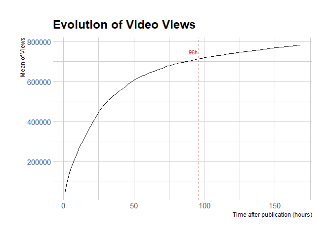<!-- -->


```r
visual_96 %>%
  ggplot(aes(x = 1, y = (views_96))) +
  geom_boxplot()
```

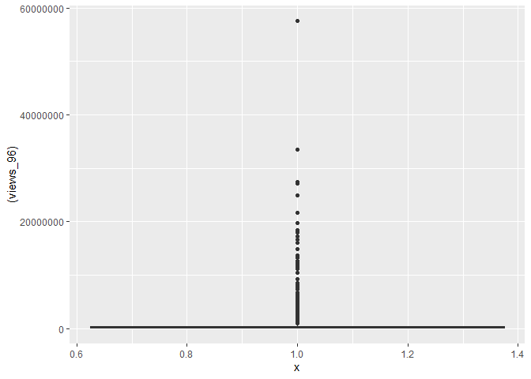<!-- -->


### Exploring correlation with predictor features


```r
# General
cor.test(visual_96$general.duration, visual_96$views_96)
```

```
## 
## 	Pearson's product-moment correlation
## 
## data:  visual_96$general.duration and visual_96$views_96
## t = -3.2153, df = 1818, p-value = 0.001326
## alternative hypothesis: true correlation is not equal to 0
## 95 percent confidence interval:
##  -0.12072727 -0.02935021
## sample estimates:
##        cor 
## -0.0751966
```

```r
cor.test(visual_96$general.fps, visual_96$views_96)
```

```
## 
## 	Pearson's product-moment correlation
## 
## data:  visual_96$general.fps and visual_96$views_96
## t = -9.2755, df = 1818, p-value < 0.00000000000000022
## alternative hypothesis: true correlation is not equal to 0
## 95 percent confidence interval:
##  -0.2560154 -0.1682638
## sample estimates:
##        cor 
## -0.2125682
```

```r
cor.test(visual_96$general.frame_count, visual_96$views_96)
```

```
## 
## 	Pearson's product-moment correlation
## 
## data:  visual_96$general.frame_count and visual_96$views_96
## t = -3.5652, df = 1818, p-value = 0.000373
## alternative hypothesis: true correlation is not equal to 0
## 95 percent confidence interval:
##  -0.12877850 -0.03751958
## sample estimates:
##         cor 
## -0.08332373
```

```r
cor.test(visual_96$general.frame_size.height, visual_96$views_96)
```

```
## 
## 	Pearson's product-moment correlation
## 
## data:  visual_96$general.frame_size.height and visual_96$views_96
## t = 0.77041, df = 1818, p-value = 0.4412
## alternative hypothesis: true correlation is not equal to 0
## 95 percent confidence interval:
##  -0.02790539  0.06396028
## sample estimates:
##        cor 
## 0.01806557
```

```r
cor.test(visual_96$general.frame_size.width, visual_96$views_96)
```

```
## 
## 	Pearson's product-moment correlation
## 
## data:  visual_96$general.frame_size.width and visual_96$views_96
## t = -0.0066587, df = 1818, p-value = 0.9947
## alternative hypothesis: true correlation is not equal to 0
## 95 percent confidence interval:
##  -0.04610364  0.04579196
## sample estimates:
##           cor 
## -0.0001561688
```

```r
# Colors
cor.test(visual_96$dominant_color.histogram_0, visual_96$views_96)
```

```
## 
## 	Pearson's product-moment correlation
## 
## data:  visual_96$dominant_color.histogram_0 and visual_96$views_96
## t = -1.2314, df = 1818, p-value = 0.2183
## alternative hypothesis: true correlation is not equal to 0
## 95 percent confidence interval:
##  -0.07471652  0.01710266
## sample estimates:
##         cor 
## -0.02886782
```

```r
cor.test(visual_96$dominant_color.histogram_1, visual_96$views_96)
```

```
## 
## 	Pearson's product-moment correlation
## 
## data:  visual_96$dominant_color.histogram_1 and visual_96$views_96
## t = 1.4045, df = 1818, p-value = 0.1603
## alternative hypothesis: true correlation is not equal to 0
## 95 percent confidence interval:
##  -0.01304482  0.07875138
## sample estimates:
##        cor 
## 0.03292271
```

```r
cor.test(visual_96$dominant_color.histogram_2, visual_96$views_96)
```

```
## 
## 	Pearson's product-moment correlation
## 
## data:  visual_96$dominant_color.histogram_2 and visual_96$views_96
## t = 1.7926, df = 1818, p-value = 0.07321
## alternative hypothesis: true correlation is not equal to 0
## 95 percent confidence interval:
##  -0.003951114  0.087782690
## sample estimates:
##        cor 
## 0.04200431
```

```r
cor.test(visual_96$dominant_color.histogram_3, visual_96$views_96)
```

```
## 
## 	Pearson's product-moment correlation
## 
## data:  visual_96$dominant_color.histogram_3 and visual_96$views_96
## t = -3.7982, df = 1818, p-value = 0.0001506
## alternative hypothesis: true correlation is not equal to 0
## 95 percent confidence interval:
##  -0.13412920 -0.04295555
## sample estimates:
##         cor 
## -0.08872823
```

```r
cor.test(visual_96$dominant_color.histogram_4, visual_96$views_96)
```

```
## 
## 	Pearson's product-moment correlation
## 
## data:  visual_96$dominant_color.histogram_4 and visual_96$views_96
## t = -0.2758, df = 1818, p-value = 0.7827
## alternative hypothesis: true correlation is not equal to 0
## 95 percent confidence interval:
##  -0.05240041  0.03949136
## sample estimates:
##         cor 
## -0.00646818
```

```r
cor.test(visual_96$dominant_color.histogram_5, visual_96$views_96)
```

```
## 
## 	Pearson's product-moment correlation
## 
## data:  visual_96$dominant_color.histogram_5 and visual_96$views_96
## t = -0.97371, df = 1818, p-value = 0.3303
## alternative hypothesis: true correlation is not equal to 0
## 95 percent confidence interval:
##  -0.06870653  0.02314127
## sample estimates:
##         cor 
## -0.02283081
```

```r
cor.test(visual_96$dominant_color.histogram_6, visual_96$views_96)
```

```
## 
## 	Pearson's product-moment correlation
## 
## data:  visual_96$dominant_color.histogram_6 and visual_96$views_96
## t = 0.54765, df = 1818, p-value = 0.584
## alternative hypothesis: true correlation is not equal to 0
## 95 percent confidence interval:
##  -0.03312434  0.05875613
## sample estimates:
##        cor 
## 0.01284301
```

```r
cor.test(visual_96$dominant_color.histogram_7, visual_96$views_96)
```

```
## 
## 	Pearson's product-moment correlation
## 
## data:  visual_96$dominant_color.histogram_7 and visual_96$views_96
## t = 6.1472, df = 1818, p-value = 0.000000000967
## alternative hypothesis: true correlation is not equal to 0
## 95 percent confidence interval:
##  0.09738696 0.18741523
## sample estimates:
##       cor 
## 0.1426962
```

```r
cor.test(visual_96$dominant_color.histogram_8, visual_96$views_96)
```

```
## 
## 	Pearson's product-moment correlation
## 
## data:  visual_96$dominant_color.histogram_8 and visual_96$views_96
## t = 0.25128, df = 1818, p-value = 0.8016
## alternative hypothesis: true correlation is not equal to 0
## 95 percent confidence interval:
##  -0.04006540  0.05182702
## sample estimates:
##         cor 
## 0.005893253
```

```r
cor.test(visual_96$dominant_color.histogram_9, visual_96$views_96)
```

```
## 
## 	Pearson's product-moment correlation
## 
## data:  visual_96$dominant_color.histogram_9 and visual_96$views_96
## t = -4.343, df = 1818, p-value = 0.00001483
## alternative hypothesis: true correlation is not equal to 0
## 95 percent confidence interval:
##  -0.14659926 -0.05564532
## sample estimates:
##       cor 
## -0.101334
```

```r
# Face
cor.test(visual_96$face_detection.average_face2frame_ratio, visual_96$views_96)
```

```
## 
## 	Pearson's product-moment correlation
## 
## data:  visual_96$face_detection.average_face2frame_ratio and visual_96$views_96
## t = -0.56869, df = 1818, p-value = 0.5696
## alternative hypothesis: true correlation is not equal to 0
## 95 percent confidence interval:
##  -0.05924788  0.03263141
## sample estimates:
##         cor 
## -0.01333638
```

```r
cor.test(visual_96$face_detection.average_face_count_per_frame, visual_96$views_96)
```

```
## 
## 	Pearson's product-moment correlation
## 
## data:  visual_96$face_detection.average_face_count_per_frame and visual_96$views_96
## t = -2.2624, df = 1818, p-value = 0.02379
## alternative hypothesis: true correlation is not equal to 0
## 95 percent confidence interval:
##  -0.09869361 -0.00705547
## sample estimates:
##         cor 
## -0.05298609
```

```r
cor.test(visual_96$face_detection.average_face_present, visual_96$views_96)
```

```
## 
## 	Pearson's product-moment correlation
## 
## data:  visual_96$face_detection.average_face_present and visual_96$views_96
## t = -3.0992, df = 1818, p-value = 0.00197
## alternative hypothesis: true correlation is not equal to 0
## 95 percent confidence interval:
##  -0.11804882 -0.02663515
## sample estimates:
##         cor 
## -0.07249423
```

```r
# Text
cor.test(visual_96$text_detection.average_text2frame_ratio, visual_96$views_96)
```

```
## 
## 	Pearson's product-moment correlation
## 
## data:  visual_96$text_detection.average_text2frame_ratio and visual_96$views_96
## t = -1.9673, df = 1818, p-value = 0.0493
## alternative hypothesis: true correlation is not equal to 0
## 95 percent confidence interval:
##  -0.0918435406 -0.0001427446
## sample estimates:
##         cor 
## -0.04609024
```

```r
cor.test(visual_96$text_detection.average_text_frames, visual_96$views_96)
```

```
## 
## 	Pearson's product-moment correlation
## 
## data:  visual_96$text_detection.average_text_frames and visual_96$views_96
## t = -2.4733, df = 1818, p-value = 0.01348
## alternative hypothesis: true correlation is not equal to 0
## 95 percent confidence interval:
##  -0.10358288 -0.01199482
## sample estimates:
##        cor 
## -0.0579107
```

```r
# Shot
cor.test(visual_96$shot_detection.average_shot_length, visual_96$views_96)
```

```
## 
## 	Pearson's product-moment correlation
## 
## data:  visual_96$shot_detection.average_shot_length and visual_96$views_96
## t = -2.8765, df = 1818, p-value = 0.004069
## alternative hypothesis: true correlation is not equal to 0
## 95 percent confidence interval:
##  -0.11290792 -0.02142779
## sample estimates:
##         cor 
## -0.06730932
```

```r
cor.test(visual_96$shot_detection.shots_count, visual_96$views_96)
```

```
## 
## 	Pearson's product-moment correlation
## 
## data:  visual_96$shot_detection.shots_count and visual_96$views_96
## t = 1.1586, df = 1818, p-value = 0.2468
## alternative hypothesis: true correlation is not equal to 0
## 95 percent confidence interval:
##  -0.01880869  0.07301925
## sample estimates:
##        cor 
## 0.02716258
```

```r
cor.test(visual_96$shot_detection.transition_histogram_0, visual_96$views_96)
```

```
## 
## 	Pearson's product-moment correlation
## 
## data:  visual_96$shot_detection.transition_histogram_0 and visual_96$views_96
## t = 0.64547, df = 1818, p-value = 0.5187
## alternative hypothesis: true correlation is not equal to 0
## 95 percent confidence interval:
##  -0.03083255  0.06104204
## sample estimates:
##        cor 
## 0.01513669
```

```r
cor.test(visual_96$shot_detection.transition_histogram_1, visual_96$views_96)
```

```
## 
## 	Pearson's product-moment correlation
## 
## data:  visual_96$shot_detection.transition_histogram_1 and visual_96$views_96
## t = -0.64547, df = 1818, p-value = 0.5187
## alternative hypothesis: true correlation is not equal to 0
## 95 percent confidence interval:
##  -0.06104204  0.03083255
## sample estimates:
##         cor 
## -0.01513669
```

```r
# Other
cor.test(visual_96$other.average_movie_speed, visual_96$views_96)
```

```
## 
## 	Pearson's product-moment correlation
## 
## data:  visual_96$other.average_movie_speed and visual_96$views_96
## t = -0.019576, df = 1818, p-value = 0.9844
## alternative hypothesis: true correlation is not equal to 0
## 95 percent confidence interval:
##  -0.04640594  0.04548964
## sample estimates:
##           cor 
## -0.0004591206
```

```r
cor.test(visual_96$other.clutter_metric, visual_96$views_96)
```

```
## 
## 	Pearson's product-moment correlation
## 
## data:  visual_96$other.clutter_metric and visual_96$views_96
## t = -1.2345, df = 1818, p-value = 0.2172
## alternative hypothesis: true correlation is not equal to 0
## 95 percent confidence interval:
##  -0.07478985  0.01702894
## sample estimates:
##         cor 
## -0.02894151
```

```r
cor.test(visual_96$rigidity.average_rigidity, visual_96$views_96)
```

```
## 
## 	Pearson's product-moment correlation
## 
## data:  visual_96$rigidity.average_rigidity and visual_96$views_96
## t = -6.6091, df = 1818, p-value = 0.00000000005066
## alternative hypothesis: true correlation is not equal to 0
## 95 percent confidence interval:
##  -0.1977312 -0.1079873
## sample estimates:
##        cor 
## -0.1531751
```

```r
cor(visual_96 %>% select(-facebook_post_id,-dominant_color.value))
```

```
##                                             dominant_color.histogram_0
## dominant_color.histogram_0                                  1.00000000
## dominant_color.histogram_1                                 -0.09046052
## dominant_color.histogram_2                                 -0.12612281
## dominant_color.histogram_3                                  0.02045443
## dominant_color.histogram_4                                 -0.02755644
## dominant_color.histogram_5                                 -0.01844551
## dominant_color.histogram_6                                 -0.04632451
## dominant_color.histogram_7                                 -0.10828608
## dominant_color.histogram_8                                 -0.05430099
## dominant_color.histogram_9                                  0.07851439
## face_detection.average_face2frame_ratio                     0.02742823
## face_detection.average_face_count_per_frame                 0.03599911
## face_detection.average_face_present                         0.07284479
## general.duration                                            0.14269701
## general.fps                                                 0.09347542
## general.frame_count                                         0.14562781
## general.frame_size.height                                  -0.05878240
## general.frame_size.width                                   -0.05301121
## other.average_movie_speed                                  -0.01310103
## other.clutter_metric                                        0.02554903
## rigidity.average_rigidity                                   0.06173845
## shot_detection.average_shot_length                          0.03289224
## shot_detection.shots_count                                  0.02794721
## shot_detection.transition_histogram_0                       0.02462485
## shot_detection.transition_histogram_1                      -0.02462485
## text_detection.average_text2frame_ratio                    -0.07613755
## text_detection.average_text_frames                         -0.07899611
## views_96                                                   -0.02886782
##                                             dominant_color.histogram_1
## dominant_color.histogram_0                                -0.090460520
## dominant_color.histogram_1                                 1.000000000
## dominant_color.histogram_2                                -0.194475387
## dominant_color.histogram_3                                -0.326979478
## dominant_color.histogram_4                                -0.084000367
## dominant_color.histogram_5                                -0.070442367
## dominant_color.histogram_6                                -0.080708858
## dominant_color.histogram_7                                -0.170542565
## dominant_color.histogram_8                                -0.148229567
## dominant_color.histogram_9                                -0.252915307
## face_detection.average_face2frame_ratio                   -0.054169808
## face_detection.average_face_count_per_frame               -0.077561568
## face_detection.average_face_present                       -0.095931444
## general.duration                                          -0.087528207
## general.fps                                               -0.206750635
## general.frame_count                                       -0.095995853
## general.frame_size.height                                 -0.012210011
## general.frame_size.width                                  -0.008959300
## other.average_movie_speed                                  0.038186371
## other.clutter_metric                                      -0.064511297
## rigidity.average_rigidity                                 -0.093422567
## shot_detection.average_shot_length                        -0.055075552
## shot_detection.shots_count                                 0.004074644
## shot_detection.transition_histogram_0                     -0.023243778
## shot_detection.transition_histogram_1                      0.023243778
## text_detection.average_text2frame_ratio                    0.059475931
## text_detection.average_text_frames                         0.079062053
## views_96                                                   0.032922714
##                                             dominant_color.histogram_2
## dominant_color.histogram_0                                -0.126122806
## dominant_color.histogram_1                                -0.194475387
## dominant_color.histogram_2                                 1.000000000
## dominant_color.histogram_3                                -0.281682901
## dominant_color.histogram_4                                -0.091303351
## dominant_color.histogram_5                                -0.057178590
## dominant_color.histogram_6                                -0.070660538
## dominant_color.histogram_7                                -0.085490244
## dominant_color.histogram_8                                -0.144106143
## dominant_color.histogram_9                                -0.298851068
## face_detection.average_face2frame_ratio                    0.007151047
## face_detection.average_face_count_per_frame               -0.123893078
## face_detection.average_face_present                       -0.149435440
## general.duration                                          -0.221143613
## general.fps                                               -0.072938744
## general.frame_count                                       -0.225776591
## general.frame_size.height                                  0.182899539
## general.frame_size.width                                   0.186875259
## other.average_movie_speed                                  0.001710201
## other.clutter_metric                                      -0.167713775
## rigidity.average_rigidity                                 -0.044118982
## shot_detection.average_shot_length                        -0.180734648
## shot_detection.shots_count                                 0.012781469
## shot_detection.transition_histogram_0                      0.069573632
## shot_detection.transition_histogram_1                     -0.069573632
## text_detection.average_text2frame_ratio                    0.064770428
## text_detection.average_text_frames                         0.091433217
## views_96                                                   0.042004311
##                                             dominant_color.histogram_3
## dominant_color.histogram_0                                 0.020454428
## dominant_color.histogram_1                                -0.326979478
## dominant_color.histogram_2                                -0.281682901
## dominant_color.histogram_3                                 1.000000000
## dominant_color.histogram_4                                 0.004837272
## dominant_color.histogram_5                                -0.075273937
## dominant_color.histogram_6                                -0.124017999
## dominant_color.histogram_7                                -0.223781657
## dominant_color.histogram_8                                -0.161515393
## dominant_color.histogram_9                                -0.001324480
## face_detection.average_face2frame_ratio                    0.011089983
## face_detection.average_face_count_per_frame                0.084364524
## face_detection.average_face_present                        0.128962845
## general.duration                                           0.141551679
## general.fps                                                0.206855666
## general.frame_count                                        0.150520669
## general.frame_size.height                                 -0.066008453
## general.frame_size.width                                  -0.060952310
## other.average_movie_speed                                 -0.030115465
## other.clutter_metric                                       0.071150894
## rigidity.average_rigidity                                  0.111279569
## shot_detection.average_shot_length                         0.029142339
## shot_detection.shots_count                                 0.009579702
## shot_detection.transition_histogram_0                     -0.017481287
## shot_detection.transition_histogram_1                      0.017481287
## text_detection.average_text2frame_ratio                   -0.006340546
## text_detection.average_text_frames                        -0.023940302
## views_96                                                  -0.088728226
##                                             dominant_color.histogram_4
## dominant_color.histogram_0                                -0.027556444
## dominant_color.histogram_1                                -0.084000367
## dominant_color.histogram_2                                -0.091303351
## dominant_color.histogram_3                                 0.004837272
## dominant_color.histogram_4                                 1.000000000
## dominant_color.histogram_5                                 0.003824743
## dominant_color.histogram_6                                -0.029260605
## dominant_color.histogram_7                                -0.052968518
## dominant_color.histogram_8                                -0.032485657
## dominant_color.histogram_9                                -0.047403555
## face_detection.average_face2frame_ratio                   -0.032069909
## face_detection.average_face_count_per_frame               -0.010337302
## face_detection.average_face_present                        0.004085415
## general.duration                                           0.009185000
## general.fps                                               -0.002077143
## general.frame_count                                        0.007860907
## general.frame_size.height                                 -0.025382036
## general.frame_size.width                                  -0.023318506
## other.average_movie_speed                                 -0.011971866
## other.clutter_metric                                      -0.018581519
## rigidity.average_rigidity                                 -0.028201299
## shot_detection.average_shot_length                        -0.014972804
## shot_detection.shots_count                                -0.003970527
## shot_detection.transition_histogram_0                      0.016429607
## shot_detection.transition_histogram_1                     -0.016429607
## text_detection.average_text2frame_ratio                   -0.030962517
## text_detection.average_text_frames                        -0.037542558
## views_96                                                  -0.006468180
##                                             dominant_color.histogram_5
## dominant_color.histogram_0                                -0.018445511
## dominant_color.histogram_1                                -0.070442367
## dominant_color.histogram_2                                -0.057178590
## dominant_color.histogram_3                                -0.075273937
## dominant_color.histogram_4                                 0.003824743
## dominant_color.histogram_5                                 1.000000000
## dominant_color.histogram_6                                 0.135459089
## dominant_color.histogram_7                                -0.017901785
## dominant_color.histogram_8                                -0.042228595
## dominant_color.histogram_9                                -0.036054422
## face_detection.average_face2frame_ratio                   -0.033919435
## face_detection.average_face_count_per_frame               -0.042111921
## face_detection.average_face_present                       -0.033878425
## general.duration                                          -0.006911141
## general.fps                                                0.008681196
## general.frame_count                                       -0.006896130
## general.frame_size.height                                 -0.011125963
## general.frame_size.width                                  -0.006363749
## other.average_movie_speed                                 -0.008750468
## other.clutter_metric                                       0.035041850
## rigidity.average_rigidity                                 -0.017570608
## shot_detection.average_shot_length                        -0.013596831
## shot_detection.shots_count                                -0.006157640
## shot_detection.transition_histogram_0                     -0.020254849
## shot_detection.transition_histogram_1                      0.020254849
## text_detection.average_text2frame_ratio                    0.053077663
## text_detection.average_text_frames                         0.050271037
## views_96                                                  -0.022830808
##                                             dominant_color.histogram_6
## dominant_color.histogram_0                                -0.046324512
## dominant_color.histogram_1                                -0.080708858
## dominant_color.histogram_2                                -0.070660538
## dominant_color.histogram_3                                -0.124017999
## dominant_color.histogram_4                                -0.029260605
## dominant_color.histogram_5                                 0.135459089
## dominant_color.histogram_6                                 1.000000000
## dominant_color.histogram_7                                 0.020874489
## dominant_color.histogram_8                                -0.062822481
## dominant_color.histogram_9                                -0.108053743
## face_detection.average_face2frame_ratio                   -0.062324814
## face_detection.average_face_count_per_frame               -0.079519037
## face_detection.average_face_present                       -0.075132298
## general.duration                                          -0.074609120
## general.fps                                                0.001867346
## general.frame_count                                       -0.073348787
## general.frame_size.height                                  0.065763384
## general.frame_size.width                                   0.068917815
## other.average_movie_speed                                 -0.008577803
## other.clutter_metric                                       0.008636842
## rigidity.average_rigidity                                  0.004251749
## shot_detection.average_shot_length                        -0.056707098
## shot_detection.shots_count                                -0.032419569
## shot_detection.transition_histogram_0                      0.013703205
## shot_detection.transition_histogram_1                     -0.013703205
## text_detection.average_text2frame_ratio                    0.054922413
## text_detection.average_text_frames                         0.074850045
## views_96                                                   0.012843007
##                                             dominant_color.histogram_7
## dominant_color.histogram_0                                 -0.10828608
## dominant_color.histogram_1                                 -0.17054257
## dominant_color.histogram_2                                 -0.08549024
## dominant_color.histogram_3                                 -0.22378166
## dominant_color.histogram_4                                 -0.05296852
## dominant_color.histogram_5                                 -0.01790178
## dominant_color.histogram_6                                  0.02087449
## dominant_color.histogram_7                                  1.00000000
## dominant_color.histogram_8                                  0.01173573
## dominant_color.histogram_9                                 -0.25075548
## face_detection.average_face2frame_ratio                    -0.02738690
## face_detection.average_face_count_per_frame                -0.13013219
## face_detection.average_face_present                        -0.16683161
## general.duration                                           -0.18624830
## general.fps                                                -0.01417353
## general.frame_count                                        -0.18492794
## general.frame_size.height                                   0.17141813
## general.frame_size.width                                    0.15365405
## other.average_movie_speed                                   0.01087646
## other.clutter_metric                                       -0.11297589
## rigidity.average_rigidity                                  -0.03634805
## shot_detection.average_shot_length                         -0.06474197
## shot_detection.shots_count                                 -0.03357627
## shot_detection.transition_histogram_0                       0.05733781
## shot_detection.transition_histogram_1                      -0.05733781
## text_detection.average_text2frame_ratio                     0.18377243
## text_detection.average_text_frames                          0.18125069
## views_96                                                    0.14269624
##                                             dominant_color.histogram_8
## dominant_color.histogram_0                                -0.054300992
## dominant_color.histogram_1                                -0.148229567
## dominant_color.histogram_2                                -0.144106143
## dominant_color.histogram_3                                -0.161515393
## dominant_color.histogram_4                                -0.032485657
## dominant_color.histogram_5                                -0.042228595
## dominant_color.histogram_6                                -0.062822481
## dominant_color.histogram_7                                 0.011735730
## dominant_color.histogram_8                                 1.000000000
## dominant_color.histogram_9                                -0.159587055
## face_detection.average_face2frame_ratio                    0.035103278
## face_detection.average_face_count_per_frame                0.039395591
## face_detection.average_face_present                       -0.008044334
## general.duration                                          -0.105527231
## general.fps                                               -0.124968710
## general.frame_count                                       -0.111673186
## general.frame_size.height                                 -0.011449365
## general.frame_size.width                                  -0.017382953
## other.average_movie_speed                                  0.023332474
## other.clutter_metric                                      -0.010419616
## rigidity.average_rigidity                                 -0.111901704
## shot_detection.average_shot_length                        -0.051847360
## shot_detection.shots_count                                 0.001443917
## shot_detection.transition_histogram_0                      0.112485860
## shot_detection.transition_histogram_1                     -0.112485860
## text_detection.average_text2frame_ratio                    0.009193703
## text_detection.average_text_frames                        -0.008357107
## views_96                                                   0.005893253
##                                             dominant_color.histogram_9
## dominant_color.histogram_0                                 0.078514388
## dominant_color.histogram_1                                -0.252915307
## dominant_color.histogram_2                                -0.298851068
## dominant_color.histogram_3                                -0.001324480
## dominant_color.histogram_4                                -0.047403555
## dominant_color.histogram_5                                -0.036054422
## dominant_color.histogram_6                                -0.108053743
## dominant_color.histogram_7                                -0.250755475
## dominant_color.histogram_8                                -0.159587055
## dominant_color.histogram_9                                 1.000000000
## face_detection.average_face2frame_ratio                    0.078570888
## face_detection.average_face_count_per_frame                0.255239574
## face_detection.average_face_present                        0.302122633
## general.duration                                           0.414856636
## general.fps                                                0.174447249
## general.frame_count                                        0.422747498
## general.frame_size.height                                 -0.251115249
## general.frame_size.width                                  -0.250884276
## other.average_movie_speed                                 -0.026532759
## other.clutter_metric                                       0.273045820
## rigidity.average_rigidity                                  0.143909531
## shot_detection.average_shot_length                         0.348517242
## shot_detection.shots_count                                 0.005570653
## shot_detection.transition_histogram_0                     -0.173830781
## shot_detection.transition_histogram_1                      0.173830781
## text_detection.average_text2frame_ratio                   -0.296487261
## text_detection.average_text_frames                        -0.320558691
## views_96                                                  -0.101334033
##                                             face_detection.average_face2frame_ratio
## dominant_color.histogram_0                                              0.027428226
## dominant_color.histogram_1                                             -0.054169808
## dominant_color.histogram_2                                              0.007151047
## dominant_color.histogram_3                                              0.011089983
## dominant_color.histogram_4                                             -0.032069909
## dominant_color.histogram_5                                             -0.033919435
## dominant_color.histogram_6                                             -0.062324814
## dominant_color.histogram_7                                             -0.027386904
## dominant_color.histogram_8                                              0.035103278
## dominant_color.histogram_9                                              0.078570888
## face_detection.average_face2frame_ratio                                 1.000000000
## face_detection.average_face_count_per_frame                             0.685058630
## face_detection.average_face_present                                     0.700830478
## general.duration                                                        0.023467387
## general.fps                                                            -0.007639710
## general.frame_count                                                     0.021118491
## general.frame_size.height                                              -0.112851712
## general.frame_size.width                                               -0.148562356
## other.average_movie_speed                                              -0.030680663
## other.clutter_metric                                                   -0.013965080
## rigidity.average_rigidity                                              -0.026602347
## shot_detection.average_shot_length                                      0.067097876
## shot_detection.shots_count                                              0.005446255
## shot_detection.transition_histogram_0                                   0.035309081
## shot_detection.transition_histogram_1                                  -0.035309081
## text_detection.average_text2frame_ratio                                -0.134881473
## text_detection.average_text_frames                                     -0.113150652
## views_96                                                               -0.013336382
##                                             face_detection.average_face_count_per_frame
## dominant_color.histogram_0                                                  0.035999106
## dominant_color.histogram_1                                                 -0.077561568
## dominant_color.histogram_2                                                 -0.123893078
## dominant_color.histogram_3                                                  0.084364524
## dominant_color.histogram_4                                                 -0.010337302
## dominant_color.histogram_5                                                 -0.042111921
## dominant_color.histogram_6                                                 -0.079519037
## dominant_color.histogram_7                                                 -0.130132193
## dominant_color.histogram_8                                                  0.039395591
## dominant_color.histogram_9                                                  0.255239574
## face_detection.average_face2frame_ratio                                     0.685058630
## face_detection.average_face_count_per_frame                                 1.000000000
## face_detection.average_face_present                                         0.905970085
## general.duration                                                            0.201882974
## general.fps                                                                 0.005684700
## general.frame_count                                                         0.199832494
## general.frame_size.height                                                  -0.269661112
## general.frame_size.width                                                   -0.281506530
## other.average_movie_speed                                                  -0.051992569
## other.clutter_metric                                                        0.193172400
## rigidity.average_rigidity                                                  -0.011144493
## shot_detection.average_shot_length                                          0.231356593
## shot_detection.shots_count                                                  0.003965519
## shot_detection.transition_histogram_0                                      -0.055913290
## shot_detection.transition_histogram_1                                       0.055913290
## text_detection.average_text2frame_ratio                                    -0.280556328
## text_detection.average_text_frames                                         -0.259608283
## views_96                                                                   -0.052986092
##                                             face_detection.average_face_present
## dominant_color.histogram_0                                          0.072844792
## dominant_color.histogram_1                                         -0.095931444
## dominant_color.histogram_2                                         -0.149435440
## dominant_color.histogram_3                                          0.128962845
## dominant_color.histogram_4                                          0.004085415
## dominant_color.histogram_5                                         -0.033878425
## dominant_color.histogram_6                                         -0.075132298
## dominant_color.histogram_7                                         -0.166831608
## dominant_color.histogram_8                                         -0.008044334
## dominant_color.histogram_9                                          0.302122633
## face_detection.average_face2frame_ratio                             0.700830478
## face_detection.average_face_count_per_frame                         0.905970085
## face_detection.average_face_present                                 1.000000000
## general.duration                                                    0.257518790
## general.fps                                                         0.029701443
## general.frame_count                                                 0.254726649
## general.frame_size.height                                          -0.327476624
## general.frame_size.width                                           -0.332749838
## other.average_movie_speed                                          -0.066801133
## other.clutter_metric                                                0.206779280
## rigidity.average_rigidity                                           0.013360299
## shot_detection.average_shot_length                                  0.266991734
## shot_detection.shots_count                                          0.034667189
## shot_detection.transition_histogram_0                              -0.068384605
## shot_detection.transition_histogram_1                               0.068384605
## text_detection.average_text2frame_ratio                            -0.325141982
## text_detection.average_text_frames                                 -0.310373304
## views_96                                                           -0.072494234
##                                             general.duration  general.fps
## dominant_color.histogram_0                       0.142697011  0.093475420
## dominant_color.histogram_1                      -0.087528207 -0.206750635
## dominant_color.histogram_2                      -0.221143613 -0.072938744
## dominant_color.histogram_3                       0.141551679  0.206855666
## dominant_color.histogram_4                       0.009185000 -0.002077143
## dominant_color.histogram_5                      -0.006911141  0.008681196
## dominant_color.histogram_6                      -0.074609120  0.001867346
## dominant_color.histogram_7                      -0.186248297 -0.014173535
## dominant_color.histogram_8                      -0.105527231 -0.124968710
## dominant_color.histogram_9                       0.414856636  0.174447249
## face_detection.average_face2frame_ratio          0.023467387 -0.007639710
## face_detection.average_face_count_per_frame      0.201882974  0.005684700
## face_detection.average_face_present              0.257518790  0.029701443
## general.duration                                 1.000000000  0.081695353
## general.fps                                      0.081695353  1.000000000
## general.frame_count                              0.998345059  0.126890823
## general.frame_size.height                       -0.304547072  0.319612118
## general.frame_size.width                        -0.292648294  0.332033081
## other.average_movie_speed                       -0.053109135  0.006328415
## other.clutter_metric                             0.333667176 -0.135321866
## rigidity.average_rigidity                        0.066023787  0.543973726
## shot_detection.average_shot_length               0.390245418  0.123271505
## shot_detection.shots_count                       0.520425126 -0.199467447
## shot_detection.transition_histogram_0           -0.179965158 -0.036600907
## shot_detection.transition_histogram_1            0.179965158  0.036600907
## text_detection.average_text2frame_ratio         -0.378113570  0.204143187
## text_detection.average_text_frames              -0.421303744  0.277155704
## views_96                                        -0.075196602 -0.212568151
##                                             general.frame_count
## dominant_color.histogram_0                          0.145627809
## dominant_color.histogram_1                         -0.095995853
## dominant_color.histogram_2                         -0.225776591
## dominant_color.histogram_3                          0.150520669
## dominant_color.histogram_4                          0.007860907
## dominant_color.histogram_5                         -0.006896130
## dominant_color.histogram_6                         -0.073348787
## dominant_color.histogram_7                         -0.184927944
## dominant_color.histogram_8                         -0.111673186
## dominant_color.histogram_9                          0.422747498
## face_detection.average_face2frame_ratio             0.021118491
## face_detection.average_face_count_per_frame         0.199832494
## face_detection.average_face_present                 0.254726649
## general.duration                                    0.998345059
## general.fps                                         0.126890823
## general.frame_count                                 1.000000000
## general.frame_size.height                          -0.289998558
## general.frame_size.width                           -0.278405439
## other.average_movie_speed                          -0.051814940
## other.clutter_metric                                0.328457752
## rigidity.average_rigidity                           0.091238319
## shot_detection.average_shot_length                  0.397055754
## shot_detection.shots_count                          0.492551426
## shot_detection.transition_histogram_0              -0.185050663
## shot_detection.transition_histogram_1               0.185050663
## text_detection.average_text2frame_ratio            -0.365134547
## text_detection.average_text_frames                 -0.404791056
## views_96                                           -0.083323734
##                                             general.frame_size.height
## dominant_color.histogram_0                                -0.05878240
## dominant_color.histogram_1                                -0.01221001
## dominant_color.histogram_2                                 0.18289954
## dominant_color.histogram_3                                -0.06600845
## dominant_color.histogram_4                                -0.02538204
## dominant_color.histogram_5                                -0.01112596
## dominant_color.histogram_6                                 0.06576338
## dominant_color.histogram_7                                 0.17141813
## dominant_color.histogram_8                                -0.01144936
## dominant_color.histogram_9                                -0.25111525
## face_detection.average_face2frame_ratio                   -0.11285171
## face_detection.average_face_count_per_frame               -0.26966111
## face_detection.average_face_present                       -0.32747662
## general.duration                                          -0.30454707
## general.fps                                                0.31961212
## general.frame_count                                       -0.28999856
## general.frame_size.height                                  1.00000000
## general.frame_size.width                                   0.99015396
## other.average_movie_speed                                  0.13310215
## other.clutter_metric                                      -0.68510847
## rigidity.average_rigidity                                  0.45402130
## shot_detection.average_shot_length                        -0.23157713
## shot_detection.shots_count                                -0.05805337
## shot_detection.transition_histogram_0                      0.10820944
## shot_detection.transition_histogram_1                     -0.10820944
## text_detection.average_text2frame_ratio                    0.31697840
## text_detection.average_text_frames                         0.51593646
## views_96                                                   0.01806557
##                                             general.frame_size.width
## dominant_color.histogram_0                             -0.0530112101
## dominant_color.histogram_1                             -0.0089593000
## dominant_color.histogram_2                              0.1868752587
## dominant_color.histogram_3                             -0.0609523101
## dominant_color.histogram_4                             -0.0233185055
## dominant_color.histogram_5                             -0.0063637490
## dominant_color.histogram_6                              0.0689178154
## dominant_color.histogram_7                              0.1536540516
## dominant_color.histogram_8                             -0.0173829531
## dominant_color.histogram_9                             -0.2508842762
## face_detection.average_face2frame_ratio                -0.1485623563
## face_detection.average_face_count_per_frame            -0.2815065299
## face_detection.average_face_present                    -0.3327498385
## general.duration                                       -0.2926482936
## general.fps                                             0.3320330807
## general.frame_count                                    -0.2784054393
## general.frame_size.height                               0.9901539648
## general.frame_size.width                                1.0000000000
## other.average_movie_speed                               0.1294086309
## other.clutter_metric                                   -0.6706421385
## rigidity.average_rigidity                               0.4721134057
## shot_detection.average_shot_length                     -0.2265061173
## shot_detection.shots_count                             -0.0442590409
## shot_detection.transition_histogram_0                   0.1129185756
## shot_detection.transition_histogram_1                  -0.1129185756
## text_detection.average_text2frame_ratio                 0.3285724236
## text_detection.average_text_frames                      0.5282460250
## views_96                                               -0.0001561688
##                                             other.average_movie_speed
## dominant_color.histogram_0                              -0.0131010323
## dominant_color.histogram_1                               0.0381863714
## dominant_color.histogram_2                               0.0017102005
## dominant_color.histogram_3                              -0.0301154646
## dominant_color.histogram_4                              -0.0119718659
## dominant_color.histogram_5                              -0.0087504682
## dominant_color.histogram_6                              -0.0085778026
## dominant_color.histogram_7                               0.0108764593
## dominant_color.histogram_8                               0.0233324742
## dominant_color.histogram_9                              -0.0265327586
## face_detection.average_face2frame_ratio                 -0.0306806633
## face_detection.average_face_count_per_frame             -0.0519925691
## face_detection.average_face_present                     -0.0668011329
## general.duration                                        -0.0531091345
## general.fps                                              0.0063284148
## general.frame_count                                     -0.0518149400
## general.frame_size.height                                0.1331021543
## general.frame_size.width                                 0.1294086309
## other.average_movie_speed                                1.0000000000
## other.clutter_metric                                    -0.1184011101
## rigidity.average_rigidity                                0.0493020585
## shot_detection.average_shot_length                      -0.0485963632
## shot_detection.shots_count                               0.0456233431
## shot_detection.transition_histogram_0                   -0.1231021313
## shot_detection.transition_histogram_1                    0.1231021313
## text_detection.average_text2frame_ratio                  0.0369015272
## text_detection.average_text_frames                       0.0587252904
## views_96                                                -0.0004591206
##                                             other.clutter_metric
## dominant_color.histogram_0                           0.025549031
## dominant_color.histogram_1                          -0.064511297
## dominant_color.histogram_2                          -0.167713775
## dominant_color.histogram_3                           0.071150894
## dominant_color.histogram_4                          -0.018581519
## dominant_color.histogram_5                           0.035041850
## dominant_color.histogram_6                           0.008636842
## dominant_color.histogram_7                          -0.112975887
## dominant_color.histogram_8                          -0.010419616
## dominant_color.histogram_9                           0.273045820
## face_detection.average_face2frame_ratio             -0.013965080
## face_detection.average_face_count_per_frame          0.193172400
## face_detection.average_face_present                  0.206779280
## general.duration                                     0.333667176
## general.fps                                         -0.135321866
## general.frame_count                                  0.328457752
## general.frame_size.height                           -0.685108466
## general.frame_size.width                            -0.670642139
## other.average_movie_speed                           -0.118401110
## other.clutter_metric                                 1.000000000
## rigidity.average_rigidity                           -0.256708653
## shot_detection.average_shot_length                   0.326967120
## shot_detection.shots_count                          -0.018399668
## shot_detection.transition_histogram_0               -0.158896296
## shot_detection.transition_histogram_1                0.158896296
## text_detection.average_text2frame_ratio             -0.196040807
## text_detection.average_text_frames                  -0.317185000
## views_96                                            -0.028941506
##                                             rigidity.average_rigidity
## dominant_color.histogram_0                                0.061738450
## dominant_color.histogram_1                               -0.093422567
## dominant_color.histogram_2                               -0.044118982
## dominant_color.histogram_3                                0.111279569
## dominant_color.histogram_4                               -0.028201299
## dominant_color.histogram_5                               -0.017570608
## dominant_color.histogram_6                                0.004251749
## dominant_color.histogram_7                               -0.036348047
## dominant_color.histogram_8                               -0.111901704
## dominant_color.histogram_9                                0.143909531
## face_detection.average_face2frame_ratio                  -0.026602347
## face_detection.average_face_count_per_frame              -0.011144493
## face_detection.average_face_present                       0.013360299
## general.duration                                          0.066023787
## general.fps                                               0.543973726
## general.frame_count                                       0.091238319
## general.frame_size.height                                 0.454021296
## general.frame_size.width                                  0.472113406
## other.average_movie_speed                                 0.049302059
## other.clutter_metric                                     -0.256708653
## rigidity.average_rigidity                                 1.000000000
## shot_detection.average_shot_length                        0.104695413
## shot_detection.shots_count                               -0.144097583
## shot_detection.transition_histogram_0                    -0.084765243
## shot_detection.transition_histogram_1                     0.084765243
## text_detection.average_text2frame_ratio                   0.219719465
## text_detection.average_text_frames                        0.320158967
## views_96                                                 -0.153175051
##                                             shot_detection.average_shot_length
## dominant_color.histogram_0                                          0.03289224
## dominant_color.histogram_1                                         -0.05507555
## dominant_color.histogram_2                                         -0.18073465
## dominant_color.histogram_3                                          0.02914234
## dominant_color.histogram_4                                         -0.01497280
## dominant_color.histogram_5                                         -0.01359683
## dominant_color.histogram_6                                         -0.05670710
## dominant_color.histogram_7                                         -0.06474197
## dominant_color.histogram_8                                         -0.05184736
## dominant_color.histogram_9                                          0.34851724
## face_detection.average_face2frame_ratio                             0.06709788
## face_detection.average_face_count_per_frame                         0.23135659
## face_detection.average_face_present                                 0.26699173
## general.duration                                                    0.39024542
## general.fps                                                         0.12327150
## general.frame_count                                                 0.39705575
## general.frame_size.height                                          -0.23157713
## general.frame_size.width                                           -0.22650612
## other.average_movie_speed                                          -0.04859636
## other.clutter_metric                                                0.32696712
## rigidity.average_rigidity                                           0.10469541
## shot_detection.average_shot_length                                  1.00000000
## shot_detection.shots_count                                         -0.12431333
## shot_detection.transition_histogram_0                              -0.16917108
## shot_detection.transition_histogram_1                               0.16917108
## text_detection.average_text2frame_ratio                            -0.26951014
## text_detection.average_text_frames                                 -0.24910380
## views_96                                                           -0.06730932
##                                             shot_detection.shots_count
## dominant_color.histogram_0                                 0.027947208
## dominant_color.histogram_1                                 0.004074644
## dominant_color.histogram_2                                 0.012781469
## dominant_color.histogram_3                                 0.009579702
## dominant_color.histogram_4                                -0.003970527
## dominant_color.histogram_5                                -0.006157640
## dominant_color.histogram_6                                -0.032419569
## dominant_color.histogram_7                                -0.033576268
## dominant_color.histogram_8                                 0.001443917
## dominant_color.histogram_9                                 0.005570653
## face_detection.average_face2frame_ratio                    0.005446255
## face_detection.average_face_count_per_frame                0.003965519
## face_detection.average_face_present                        0.034667189
## general.duration                                           0.520425126
## general.fps                                               -0.199467447
## general.frame_count                                        0.492551426
## general.frame_size.height                                 -0.058053371
## general.frame_size.width                                  -0.044259041
## other.average_movie_speed                                  0.045623343
## other.clutter_metric                                      -0.018399668
## rigidity.average_rigidity                                 -0.144097583
## shot_detection.average_shot_length                        -0.124313333
## shot_detection.shots_count                                 1.000000000
## shot_detection.transition_histogram_0                      0.004223192
## shot_detection.transition_histogram_1                     -0.004223192
## text_detection.average_text2frame_ratio                   -0.173066107
## text_detection.average_text_frames                        -0.205439191
## views_96                                                   0.027162581
##                                             shot_detection.transition_histogram_0
## dominant_color.histogram_0                                            0.024624851
## dominant_color.histogram_1                                           -0.023243778
## dominant_color.histogram_2                                            0.069573632
## dominant_color.histogram_3                                           -0.017481287
## dominant_color.histogram_4                                            0.016429607
## dominant_color.histogram_5                                           -0.020254849
## dominant_color.histogram_6                                            0.013703205
## dominant_color.histogram_7                                            0.057337813
## dominant_color.histogram_8                                            0.112485860
## dominant_color.histogram_9                                           -0.173830781
## face_detection.average_face2frame_ratio                               0.035309081
## face_detection.average_face_count_per_frame                          -0.055913290
## face_detection.average_face_present                                  -0.068384605
## general.duration                                                     -0.179965158
## general.fps                                                          -0.036600907
## general.frame_count                                                  -0.185050663
## general.frame_size.height                                             0.108209437
## general.frame_size.width                                              0.112918576
## other.average_movie_speed                                            -0.123102131
## other.clutter_metric                                                 -0.158896296
## rigidity.average_rigidity                                            -0.084765243
## shot_detection.average_shot_length                                   -0.169171084
## shot_detection.shots_count                                            0.004223192
## shot_detection.transition_histogram_0                                 1.000000000
## shot_detection.transition_histogram_1                                -1.000000000
## text_detection.average_text2frame_ratio                               0.104068879
## text_detection.average_text_frames                                    0.114091770
## views_96                                                              0.015136693
##                                             shot_detection.transition_histogram_1
## dominant_color.histogram_0                                           -0.024624851
## dominant_color.histogram_1                                            0.023243778
## dominant_color.histogram_2                                           -0.069573632
## dominant_color.histogram_3                                            0.017481287
## dominant_color.histogram_4                                           -0.016429607
## dominant_color.histogram_5                                            0.020254849
## dominant_color.histogram_6                                           -0.013703205
## dominant_color.histogram_7                                           -0.057337813
## dominant_color.histogram_8                                           -0.112485860
## dominant_color.histogram_9                                            0.173830781
## face_detection.average_face2frame_ratio                              -0.035309081
## face_detection.average_face_count_per_frame                           0.055913290
## face_detection.average_face_present                                   0.068384605
## general.duration                                                      0.179965158
## general.fps                                                           0.036600907
## general.frame_count                                                   0.185050663
## general.frame_size.height                                            -0.108209437
## general.frame_size.width                                             -0.112918576
## other.average_movie_speed                                             0.123102131
## other.clutter_metric                                                  0.158896296
## rigidity.average_rigidity                                             0.084765243
## shot_detection.average_shot_length                                    0.169171084
## shot_detection.shots_count                                           -0.004223192
## shot_detection.transition_histogram_0                                -1.000000000
## shot_detection.transition_histogram_1                                 1.000000000
## text_detection.average_text2frame_ratio                              -0.104068879
## text_detection.average_text_frames                                   -0.114091770
## views_96                                                             -0.015136693
##                                             text_detection.average_text2frame_ratio
## dominant_color.histogram_0                                             -0.076137547
## dominant_color.histogram_1                                              0.059475931
## dominant_color.histogram_2                                              0.064770428
## dominant_color.histogram_3                                             -0.006340546
## dominant_color.histogram_4                                             -0.030962517
## dominant_color.histogram_5                                              0.053077663
## dominant_color.histogram_6                                              0.054922413
## dominant_color.histogram_7                                              0.183772432
## dominant_color.histogram_8                                              0.009193703
## dominant_color.histogram_9                                             -0.296487261
## face_detection.average_face2frame_ratio                                -0.134881473
## face_detection.average_face_count_per_frame                            -0.280556328
## face_detection.average_face_present                                    -0.325141982
## general.duration                                                       -0.378113570
## general.fps                                                             0.204143187
## general.frame_count                                                    -0.365134547
## general.frame_size.height                                               0.316978399
## general.frame_size.width                                                0.328572424
## other.average_movie_speed                                               0.036901527
## other.clutter_metric                                                   -0.196040807
## rigidity.average_rigidity                                               0.219719465
## shot_detection.average_shot_length                                     -0.269510138
## shot_detection.shots_count                                             -0.173066107
## shot_detection.transition_histogram_0                                   0.104068879
## shot_detection.transition_histogram_1                                  -0.104068879
## text_detection.average_text2frame_ratio                                 1.000000000
## text_detection.average_text_frames                                      0.871494696
## views_96                                                               -0.046090242
##                                             text_detection.average_text_frames
## dominant_color.histogram_0                                        -0.078996110
## dominant_color.histogram_1                                         0.079062053
## dominant_color.histogram_2                                         0.091433217
## dominant_color.histogram_3                                        -0.023940302
## dominant_color.histogram_4                                        -0.037542558
## dominant_color.histogram_5                                         0.050271037
## dominant_color.histogram_6                                         0.074850045
## dominant_color.histogram_7                                         0.181250686
## dominant_color.histogram_8                                        -0.008357107
## dominant_color.histogram_9                                        -0.320558691
## face_detection.average_face2frame_ratio                           -0.113150652
## face_detection.average_face_count_per_frame                       -0.259608283
## face_detection.average_face_present                               -0.310373304
## general.duration                                                  -0.421303744
## general.fps                                                        0.277155704
## general.frame_count                                               -0.404791056
## general.frame_size.height                                          0.515936459
## general.frame_size.width                                           0.528246025
## other.average_movie_speed                                          0.058725290
## other.clutter_metric                                              -0.317185000
## rigidity.average_rigidity                                          0.320158967
## shot_detection.average_shot_length                                -0.249103801
## shot_detection.shots_count                                        -0.205439191
## shot_detection.transition_histogram_0                              0.114091770
## shot_detection.transition_histogram_1                             -0.114091770
## text_detection.average_text2frame_ratio                            0.871494696
## text_detection.average_text_frames                                 1.000000000
## views_96                                                          -0.057910699
##                                                  views_96
## dominant_color.histogram_0                  -0.0288678220
## dominant_color.histogram_1                   0.0329227140
## dominant_color.histogram_2                   0.0420043114
## dominant_color.histogram_3                  -0.0887282265
## dominant_color.histogram_4                  -0.0064681805
## dominant_color.histogram_5                  -0.0228308077
## dominant_color.histogram_6                   0.0128430070
## dominant_color.histogram_7                   0.1426962373
## dominant_color.histogram_8                   0.0058932525
## dominant_color.histogram_9                  -0.1013340328
## face_detection.average_face2frame_ratio     -0.0133363819
## face_detection.average_face_count_per_frame -0.0529860923
## face_detection.average_face_present         -0.0724942338
## general.duration                            -0.0751966020
## general.fps                                 -0.2125681511
## general.frame_count                         -0.0833237343
## general.frame_size.height                    0.0180655693
## general.frame_size.width                    -0.0001561688
## other.average_movie_speed                   -0.0004591206
## other.clutter_metric                        -0.0289415063
## rigidity.average_rigidity                   -0.1531750510
## shot_detection.average_shot_length          -0.0673093171
## shot_detection.shots_count                   0.0271625811
## shot_detection.transition_histogram_0        0.0151366928
## shot_detection.transition_histogram_1       -0.0151366928
## text_detection.average_text2frame_ratio     -0.0460902421
## text_detection.average_text_frames          -0.0579106993
## views_96                                     1.0000000000
```

# Initial modeling

## Linear models


```r
## Each feature
# General
lm(visual_96$views_96 ~ visual_96$general.duration) %>% summary()
```

```
## 
## Call:
## lm(formula = visual_96$views_96 ~ visual_96$general.duration)
## 
## Residuals:
##      Min       1Q   Median       3Q      Max 
##  -843602  -685150  -543045  -254961 56757715 
## 
## Coefficients:
##                            Estimate Std. Error t value
## (Intercept)                849484.5    73425.3  11.569
## visual_96$general.duration   -982.9      305.7  -3.215
##                                        Pr(>|t|)    
## (Intercept)                < 0.0000000000000002 ***
## visual_96$general.duration              0.00133 ** 
## ---
## Signif. codes:  0 '***' 0.001 '**' 0.01 '*' 0.05 '.' 0.1 ' ' 1
## 
## Residual standard error: 2565000 on 1818 degrees of freedom
## Multiple R-squared:  0.005655,	Adjusted R-squared:  0.005108 
## F-statistic: 10.34 on 1 and 1818 DF,  p-value: 0.001326
```

```r
lm(visual_96$views_96 ~ visual_96$general.fps) %>% summary()
```

```
## 
## Call:
## lm(formula = visual_96$views_96 ~ visual_96$general.fps)
## 
## Residuals:
##      Min       1Q   Median       3Q      Max 
## -1905581  -408059  -354339  -178559 56153998 
## 
## Coefficients:
##                       Estimate Std. Error t value            Pr(>|t|)    
## (Intercept)            7624602     747370  10.202 <0.0000000000000002 ***
## visual_96$general.fps  -248599      26802  -9.275 <0.0000000000000002 ***
## ---
## Signif. codes:  0 '***' 0.001 '**' 0.01 '*' 0.05 '.' 0.1 ' ' 1
## 
## Residual standard error: 2514000 on 1818 degrees of freedom
## Multiple R-squared:  0.04519,	Adjusted R-squared:  0.04466 
## F-statistic: 86.03 on 1 and 1818 DF,  p-value: < 0.00000000000000022
```

```r
lm(visual_96$views_96 ~ visual_96$general.frame_count) %>% summary()
```

```
## 
## Call:
## lm(formula = visual_96$views_96 ~ visual_96$general.frame_count)
## 
## Residuals:
##      Min       1Q   Median       3Q      Max 
##  -853741  -689166  -538746  -236050 56745983 
## 
## Coefficients:
##                                Estimate Std. Error t value
## (Intercept)                   859278.08   72605.00  11.835
## visual_96$general.frame_count    -37.57      10.54  -3.565
##                                           Pr(>|t|)    
## (Intercept)                   < 0.0000000000000002 ***
## visual_96$general.frame_count             0.000373 ***
## ---
## Signif. codes:  0 '***' 0.001 '**' 0.01 '*' 0.05 '.' 0.1 ' ' 1
## 
## Residual standard error: 2563000 on 1818 degrees of freedom
## Multiple R-squared:  0.006943,	Adjusted R-squared:  0.006397 
## F-statistic: 12.71 on 1 and 1818 DF,  p-value: 0.000373
```

```r
lm(visual_96$views_96 ~ visual_96$general.frame_size.height) %>% summary()
```

```
## 
## Call:
## lm(formula = visual_96$views_96 ~ visual_96$general.frame_size.height)
## 
## Residuals:
##      Min       1Q   Median       3Q      Max 
##  -767093  -658596  -589409  -300636 56881098 
## 
## Coefficients:
##                                     Estimate Std. Error t value
## (Intercept)                         632339.3   121909.3   5.187
## visual_96$general.frame_size.height    224.1      290.9   0.770
##                                        Pr(>|t|)    
## (Intercept)                         0.000000238 ***
## visual_96$general.frame_size.height       0.441    
## ---
## Signif. codes:  0 '***' 0.001 '**' 0.01 '*' 0.05 '.' 0.1 ' ' 1
## 
## Residual standard error: 2572000 on 1818 degrees of freedom
## Multiple R-squared:  0.0003264,	Adjusted R-squared:  -0.0002235 
## F-statistic: 0.5935 on 1 and 1818 DF,  p-value: 0.4412
```

```r
lm(visual_96$views_96 ~ visual_96$general.frame_size.width) %>% summary()
```

```
## 
## Call:
## lm(formula = visual_96$views_96 ~ visual_96$general.frame_size.width)
## 
## Residuals:
##      Min       1Q   Median       3Q      Max 
##  -714232  -681413  -567118  -291687 56849404 
## 
## Coefficients:
##                                      Estimate Std. Error t value
## (Intercept)                        714666.879 120590.027   5.926
## visual_96$general.frame_size.width     -1.086    163.166  -0.007
##                                        Pr(>|t|)    
## (Intercept)                        0.0000000037 ***
## visual_96$general.frame_size.width        0.995    
## ---
## Signif. codes:  0 '***' 0.001 '**' 0.01 '*' 0.05 '.' 0.1 ' ' 1
## 
## Residual standard error: 2572000 on 1818 degrees of freedom
## Multiple R-squared:  2.439e-08,	Adjusted R-squared:  -0.00055 
## F-statistic: 4.434e-05 on 1 and 1818 DF,  p-value: 0.9947
```

```r
# Color
lm(visual_96$views_96 ~ visual_96$dominant_color.histogram_0) %>% summary()
```

```
## 
## Call:
## lm(formula = visual_96$views_96 ~ visual_96$dominant_color.histogram_0)
## 
## Residuals:
##      Min       1Q   Median       3Q      Max 
##  -733638  -682480  -562291  -270480 56831104 
## 
## Coefficients:
##                                      Estimate Std. Error t value
## (Intercept)                            733638      62351  11.766
## visual_96$dominant_color.histogram_0 -1225518     995239  -1.231
##                                                 Pr(>|t|)    
## (Intercept)                          <0.0000000000000002 ***
## visual_96$dominant_color.histogram_0               0.218    
## ---
## Signif. codes:  0 '***' 0.001 '**' 0.01 '*' 0.05 '.' 0.1 ' ' 1
## 
## Residual standard error: 2571000 on 1818 degrees of freedom
## Multiple R-squared:  0.0008334,	Adjusted R-squared:  0.0002838 
## F-statistic: 1.516 on 1 and 1818 DF,  p-value: 0.2183
```

```r
lm(visual_96$views_96 ~ visual_96$dominant_color.histogram_1) %>% summary()
```

```
## 
## Call:
## lm(formula = visual_96$views_96 ~ visual_96$dominant_color.histogram_1)
## 
## Residuals:
##      Min       1Q   Median       3Q      Max 
##  -960165  -637558  -561927  -290113 56768142 
## 
## Coefficients:
##                                      Estimate Std. Error t value
## (Intercept)                            626020      86907   7.203
## visual_96$dominant_color.histogram_1   367469     261633   1.405
##                                               Pr(>|t|)    
## (Intercept)                          0.000000000000857 ***
## visual_96$dominant_color.histogram_1              0.16    
## ---
## Signif. codes:  0 '***' 0.001 '**' 0.01 '*' 0.05 '.' 0.1 ' ' 1
## 
## Residual standard error: 2571000 on 1818 degrees of freedom
## Multiple R-squared:  0.001084,	Adjusted R-squared:  0.0005344 
## F-statistic: 1.973 on 1 and 1818 DF,  p-value: 0.1603
```

```r
lm(visual_96$views_96 ~ visual_96$dominant_color.histogram_2) %>% summary()
```

```
## 
## Call:
## lm(formula = visual_96$views_96 ~ visual_96$dominant_color.histogram_2)
## 
## Residuals:
##      Min       1Q   Median       3Q      Max 
## -1079141  -628744  -555245  -279315 56853418 
## 
## Coefficients:
##                                      Estimate Std. Error t value
## (Intercept)                            595354      89487   6.653
## visual_96$dominant_color.histogram_2   493290     275187   1.793
##                                             Pr(>|t|)    
## (Intercept)                          0.0000000000379 ***
## visual_96$dominant_color.histogram_2          0.0732 .  
## ---
## Signif. codes:  0 '***' 0.001 '**' 0.01 '*' 0.05 '.' 0.1 ' ' 1
## 
## Residual standard error: 2570000 on 1818 degrees of freedom
## Multiple R-squared:  0.001764,	Adjusted R-squared:  0.001215 
## F-statistic: 3.213 on 1 and 1818 DF,  p-value: 0.07321
```

```r
lm(visual_96$views_96 ~ visual_96$dominant_color.histogram_3) %>% summary()
```

```
## 
## Call:
## lm(formula = visual_96$views_96 ~ visual_96$dominant_color.histogram_3)
## 
## Residuals:
##      Min       1Q   Median       3Q      Max 
##  -893917  -714963  -532968  -145034 56905207 
## 
## Coefficients:
##                                      Estimate Std. Error t value
## (Intercept)                            893917      76495  11.686
## visual_96$dominant_color.histogram_3 -1091717     287432  -3.798
##                                                  Pr(>|t|)    
## (Intercept)                          < 0.0000000000000002 ***
## visual_96$dominant_color.histogram_3             0.000151 ***
## ---
## Signif. codes:  0 '***' 0.001 '**' 0.01 '*' 0.05 '.' 0.1 ' ' 1
## 
## Residual standard error: 2562000 on 1818 degrees of freedom
## Multiple R-squared:  0.007873,	Adjusted R-squared:  0.007327 
## F-statistic: 14.43 on 1 and 1818 DF,  p-value: 0.0001506
```

```r
lm(visual_96$views_96 ~ visual_96$dominant_color.histogram_4) %>% summary()
```

```
## 
## Call:
## lm(formula = visual_96$views_96 ~ visual_96$dominant_color.histogram_4)
## 
## Residuals:
##      Min       1Q   Median       3Q      Max 
##  -718277  -681890  -567132  -294076 56845359 
## 
## Coefficients:
##                                      Estimate Std. Error t value
## (Intercept)                            718277      62283  11.533
## visual_96$dominant_color.histogram_4  -256860     931339  -0.276
##                                                 Pr(>|t|)    
## (Intercept)                          <0.0000000000000002 ***
## visual_96$dominant_color.histogram_4               0.783    
## ---
## Signif. codes:  0 '***' 0.001 '**' 0.01 '*' 0.05 '.' 0.1 ' ' 1
## 
## Residual standard error: 2572000 on 1818 degrees of freedom
## Multiple R-squared:  4.184e-05,	Adjusted R-squared:  -0.0005082 
## F-statistic: 0.07606 on 1 and 1818 DF,  p-value: 0.7827
```

```r
lm(visual_96$views_96 ~ visual_96$dominant_color.histogram_5) %>% summary()
```

```
## 
## Call:
## lm(formula = visual_96$views_96 ~ visual_96$dominant_color.histogram_5)
## 
## Residuals:
##      Min       1Q   Median       3Q      Max 
##  -727010  -688575  -567869  -277662 56839816 
## 
## Coefficients:
##                                      Estimate Std. Error t value
## (Intercept)                            727010      61749  11.774
## visual_96$dominant_color.histogram_5 -1178100    1209904  -0.974
##                                                 Pr(>|t|)    
## (Intercept)                          <0.0000000000000002 ***
## visual_96$dominant_color.histogram_5                0.33    
## ---
## Signif. codes:  0 '***' 0.001 '**' 0.01 '*' 0.05 '.' 0.1 ' ' 1
## 
## Residual standard error: 2572000 on 1818 degrees of freedom
## Multiple R-squared:  0.0005212,	Adjusted R-squared:  -2.852e-05 
## F-statistic: 0.9481 on 1 and 1818 DF,  p-value: 0.3303
```

```r
lm(visual_96$views_96 ~ visual_96$dominant_color.histogram_6) %>% summary()
```

```
## 
## Call:
## lm(formula = visual_96$views_96 ~ visual_96$dominant_color.histogram_6)
## 
## Residuals:
##      Min       1Q   Median       3Q      Max 
## -1047591  -675117  -569460  -291126 56859564 
## 
## Coefficients:
##                                      Estimate Std. Error t value
## (Intercept)                            704072      62942  11.186
## visual_96$dominant_color.histogram_6   389982     712108   0.548
##                                                 Pr(>|t|)    
## (Intercept)                          <0.0000000000000002 ***
## visual_96$dominant_color.histogram_6               0.584    
## ---
## Signif. codes:  0 '***' 0.001 '**' 0.01 '*' 0.05 '.' 0.1 ' ' 1
## 
## Residual standard error: 2572000 on 1818 degrees of freedom
## Multiple R-squared:  0.0001649,	Adjusted R-squared:  -0.000385 
## F-statistic: 0.2999 on 1 and 1818 DF,  p-value: 0.584
```

```r
lm(visual_96$views_96 ~ visual_96$dominant_color.histogram_7) %>% summary()
```

```
## 
## Call:
## lm(formula = visual_96$views_96 ~ visual_96$dominant_color.histogram_7)
## 
## Residuals:
##      Min       1Q   Median       3Q      Max 
## -2730545  -570759  -442599  -202143 56931167 
## 
## Coefficients:
##                                      Estimate Std. Error t value
## (Intercept)                            472487      71448   6.613
## visual_96$dominant_color.histogram_7  2272567     369692   6.147
##                                             Pr(>|t|)    
## (Intercept)                          0.0000000000493 ***
## visual_96$dominant_color.histogram_7 0.0000000009670 ***
## ---
## Signif. codes:  0 '***' 0.001 '**' 0.01 '*' 0.05 '.' 0.1 ' ' 1
## 
## Residual standard error: 2546000 on 1818 degrees of freedom
## Multiple R-squared:  0.02036,	Adjusted R-squared:  0.01982 
## F-statistic: 37.79 on 1 and 1818 DF,  p-value: 0.000000000967
```

```r
lm(visual_96$views_96 ~ visual_96$dominant_color.histogram_8) %>% summary()
```

```
## 
## Call:
## lm(formula = visual_96$views_96 ~ visual_96$dominant_color.histogram_8)
## 
## Residuals:
##      Min       1Q   Median       3Q      Max 
##  -797518  -674858  -565048  -292720 56856547 
## 
## Coefficients:
##                                      Estimate Std. Error t value
## (Intercept)                            706124      67902  10.399
## visual_96$dominant_color.histogram_8   106934     425555   0.251
##                                                 Pr(>|t|)    
## (Intercept)                          <0.0000000000000002 ***
## visual_96$dominant_color.histogram_8               0.802    
## ---
## Signif. codes:  0 '***' 0.001 '**' 0.01 '*' 0.05 '.' 0.1 ' ' 1
## 
## Residual standard error: 2572000 on 1818 degrees of freedom
## Multiple R-squared:  3.473e-05,	Adjusted R-squared:  -0.0005153 
## F-statistic: 0.06314 on 1 and 1818 DF,  p-value: 0.8016
```

```r
lm(visual_96$views_96 ~ visual_96$dominant_color.histogram_9) %>% summary()
```

```
## 
## Call:
## lm(formula = visual_96$views_96 ~ visual_96$dominant_color.histogram_9)
## 
## Residuals:
##      Min       1Q   Median       3Q      Max 
##  -855259  -724261  -550897  -115378 56717959 
## 
## Coefficients:
##                                      Estimate Std. Error t value
## (Intercept)                            855259      68239  12.533
## visual_96$dominant_color.histogram_9 -1327120     305574  -4.343
##                                                  Pr(>|t|)    
## (Intercept)                          < 0.0000000000000002 ***
## visual_96$dominant_color.histogram_9            0.0000148 ***
## ---
## Signif. codes:  0 '***' 0.001 '**' 0.01 '*' 0.05 '.' 0.1 ' ' 1
## 
## Residual standard error: 2559000 on 1818 degrees of freedom
## Multiple R-squared:  0.01027,	Adjusted R-squared:  0.009724 
## F-statistic: 18.86 on 1 and 1818 DF,  p-value: 0.00001483
```

```r
lm(visual_96$views_96 ~ visual_96$dominant_color.value) %>% summary()
```

```
## 
## Call:
## lm(formula = visual_96$views_96 ~ visual_96$dominant_color.value)
## 
## Residuals:
##      Min       1Q   Median       3Q      Max 
## -1499331  -716126  -392091   -66929 56645026 
## 
## Coefficients:
##                                 Estimate Std. Error t value Pr(>|t|)  
## (Intercept)                       148234     681783   0.217   0.8279  
## visual_96$dominant_color.value1   770376     691377   1.114   0.2653  
## visual_96$dominant_color.value2   586843     691553   0.849   0.3962  
## visual_96$dominant_color.value3   212694     698502   0.304   0.7608  
## visual_96$dominant_color.value4   381208     880178   0.433   0.6650  
## visual_96$dominant_color.value5   273004    1130610   0.241   0.8092  
## visual_96$dominant_color.value6   730564     800443   0.913   0.3615  
## visual_96$dominant_color.value7  1351096     708833   1.906   0.0568 .
## visual_96$dominant_color.value8   456665     729326   0.626   0.5313  
## visual_96$dominant_color.value9   -51574     704248  -0.073   0.9416  
## ---
## Signif. codes:  0 '***' 0.001 '**' 0.01 '*' 0.05 '.' 0.1 ' ' 1
## 
## Residual standard error: 2551000 on 1810 degrees of freedom
## Multiple R-squared:  0.02082,	Adjusted R-squared:  0.01595 
## F-statistic: 4.276 on 9 and 1810 DF,  p-value: 0.00001635
```

```r
# Face
lm(visual_96$views_96 ~ visual_96$face_detection.average_face2frame_ratio) %>% summary()
```

```
## 
## Call:
## lm(formula = visual_96$views_96 ~ visual_96$face_detection.average_face2frame_ratio)
## 
## Residuals:
##      Min       1Q   Median       3Q      Max 
##  -743253  -670368  -571152  -293643 56827626 
## 
## Coefficients:
##                                                   Estimate Std. Error
## (Intercept)                                         745857      82333
## visual_96$face_detection.average_face2frame_ratio -1222613    2149885
##                                                   t value
## (Intercept)                                         9.059
## visual_96$face_detection.average_face2frame_ratio  -0.569
##                                                              Pr(>|t|)    
## (Intercept)                                       <0.0000000000000002 ***
## visual_96$face_detection.average_face2frame_ratio                0.57    
## ---
## Signif. codes:  0 '***' 0.001 '**' 0.01 '*' 0.05 '.' 0.1 ' ' 1
## 
## Residual standard error: 2572000 on 1818 degrees of freedom
## Multiple R-squared:  0.0001779,	Adjusted R-squared:  -0.0003721 
## F-statistic: 0.3234 on 1 and 1818 DF,  p-value: 0.5696
```

```r
lm(visual_96$views_96 ~ visual_96$face_detection.average_face_count_per_frame) %>% summary()
```

```
## 
## Call:
## lm(formula = visual_96$views_96 ~ visual_96$face_detection.average_face_count_per_frame)
## 
## Residuals:
##      Min       1Q   Median       3Q      Max 
##  -853920  -667992  -555312  -259006 56751263 
## 
## Coefficients:
##                                                       Estimate Std. Error
## (Intercept)                                             856524      87153
## visual_96$face_detection.average_face_count_per_frame  -354492     156689
##                                                       t value
## (Intercept)                                             9.828
## visual_96$face_detection.average_face_count_per_frame  -2.262
##                                                                  Pr(>|t|)
## (Intercept)                                           <0.0000000000000002
## visual_96$face_detection.average_face_count_per_frame              0.0238
##                                                          
## (Intercept)                                           ***
## visual_96$face_detection.average_face_count_per_frame *  
## ---
## Signif. codes:  0 '***' 0.001 '**' 0.01 '*' 0.05 '.' 0.1 ' ' 1
## 
## Residual standard error: 2569000 on 1818 degrees of freedom
## Multiple R-squared:  0.002808,	Adjusted R-squared:  0.002259 
## F-statistic: 5.118 on 1 and 1818 DF,  p-value: 0.02379
```

```r
lm(visual_96$views_96 ~ visual_96$face_detection.average_face_present) %>% summary()
```

```
## 
## Call:
## lm(formula = visual_96$views_96 ~ visual_96$face_detection.average_face_present)
## 
## Residuals:
##      Min       1Q   Median       3Q      Max 
##  -944294  -685898  -517972  -268800 56683985 
## 
## Coefficients:
##                                               Estimate Std. Error t value
## (Intercept)                                     946898      96256   9.837
## visual_96$face_detection.average_face_present  -683571     220566  -3.099
##                                                           Pr(>|t|)    
## (Intercept)                                   < 0.0000000000000002 ***
## visual_96$face_detection.average_face_present              0.00197 ** 
## ---
## Signif. codes:  0 '***' 0.001 '**' 0.01 '*' 0.05 '.' 0.1 ' ' 1
## 
## Residual standard error: 2566000 on 1818 degrees of freedom
## Multiple R-squared:  0.005255,	Adjusted R-squared:  0.004708 
## F-statistic: 9.605 on 1 and 1818 DF,  p-value: 0.00197
```

```r
# Text
lm(visual_96$views_96 ~ visual_96$text_detection.average_text2frame_ratio) %>% summary()
```

```
## 
## Call:
## lm(formula = visual_96$views_96 ~ visual_96$text_detection.average_text2frame_ratio)
## 
## Residuals:
##      Min       1Q   Median       3Q      Max 
##  -855800  -725326  -508428  -207693 56818372 
## 
## Coefficients:
##                                                   Estimate Std. Error
## (Intercept)                                         855896      93981
## visual_96$text_detection.average_text2frame_ratio -3422866    1739892
##                                                   t value
## (Intercept)                                         9.107
## visual_96$text_detection.average_text2frame_ratio  -1.967
##                                                              Pr(>|t|)    
## (Intercept)                                       <0.0000000000000002 ***
## visual_96$text_detection.average_text2frame_ratio              0.0493 *  
## ---
## Signif. codes:  0 '***' 0.001 '**' 0.01 '*' 0.05 '.' 0.1 ' ' 1
## 
## Residual standard error: 2570000 on 1818 degrees of freedom
## Multiple R-squared:  0.002124,	Adjusted R-squared:  0.001575 
## F-statistic:  3.87 on 1 and 1818 DF,  p-value: 0.0493
```

```r
lm(visual_96$views_96 ~ visual_96$text_detection.average_text_frames) %>% summary()
```

```
## 
## Call:
## lm(formula = visual_96$views_96 ~ visual_96$text_detection.average_text_frames)
## 
## Residuals:
##      Min       1Q   Median       3Q      Max 
##  -922687  -735956  -468872  -182977 56763068 
## 
## Coefficients:
##                                              Estimate Std. Error t value
## (Intercept)                                    923418     103896   8.888
## visual_96$text_detection.average_text_frames  -491399     198678  -2.473
##                                                         Pr(>|t|)    
## (Intercept)                                  <0.0000000000000002 ***
## visual_96$text_detection.average_text_frames              0.0135 *  
## ---
## Signif. codes:  0 '***' 0.001 '**' 0.01 '*' 0.05 '.' 0.1 ' ' 1
## 
## Residual standard error: 2568000 on 1818 degrees of freedom
## Multiple R-squared:  0.003354,	Adjusted R-squared:  0.002805 
## F-statistic: 6.117 on 1 and 1818 DF,  p-value: 0.01348
```

```r
# Shot
lm(visual_96$views_96 ~ visual_96$shot_detection.average_shot_length) %>% summary()
```

```
## 
## Call:
## lm(formula = visual_96$views_96 ~ visual_96$shot_detection.average_shot_length)
## 
## Residuals:
##      Min       1Q   Median       3Q      Max 
##  -797299  -657283  -562917  -278331 56794816 
## 
## Coefficients:
##                                              Estimate Std. Error t value
## (Intercept)                                    807120      68321  11.814
## visual_96$shot_detection.average_shot_length   -12098       4206  -2.876
##                                                          Pr(>|t|)    
## (Intercept)                                  < 0.0000000000000002 ***
## visual_96$shot_detection.average_shot_length              0.00407 ** 
## ---
## Signif. codes:  0 '***' 0.001 '**' 0.01 '*' 0.05 '.' 0.1 ' ' 1
## 
## Residual standard error: 2566000 on 1818 degrees of freedom
## Multiple R-squared:  0.004531,	Adjusted R-squared:  0.003983 
## F-statistic: 8.274 on 1 and 1818 DF,  p-value: 0.004069
```

```r
lm(visual_96$views_96 ~ visual_96$shot_detection.shots_count) %>% summary()
```

```
## 
## Call:
## lm(formula = visual_96$views_96 ~ visual_96$shot_detection.shots_count)
## 
## Residuals:
##      Min       1Q   Median       3Q      Max 
## -1549981  -654573  -555173  -292341 56879404 
## 
## Coefficients:
##                                      Estimate Std. Error t value
## (Intercept)                            635447      90700   7.006
## visual_96$shot_detection.shots_count     3485       3008   1.159
##                                              Pr(>|t|)    
## (Intercept)                          0.00000000000344 ***
## visual_96$shot_detection.shots_count            0.247    
## ---
## Signif. codes:  0 '***' 0.001 '**' 0.01 '*' 0.05 '.' 0.1 ' ' 1
## 
## Residual standard error: 2571000 on 1818 degrees of freedom
## Multiple R-squared:  0.0007378,	Adjusted R-squared:  0.0001882 
## F-statistic: 1.342 on 1 and 1818 DF,  p-value: 0.2468
```

```r
lm(visual_96$views_96 ~ visual_96$shot_detection.transition_histogram_0) %>% summary()
```

```
## 
## Call:
## lm(formula = visual_96$views_96 ~ visual_96$shot_detection.transition_histogram_0)
## 
## Residuals:
##      Min       1Q   Median       3Q      Max 
##  -740457  -673040  -560146  -291714 56866250 
## 
## Coefficients:
##                                                 Estimate Std. Error
## (Intercept)                                       438959     430308
## visual_96$shot_detection.transition_histogram_0   301498     467097
##                                                 t value Pr(>|t|)
## (Intercept)                                       1.020    0.308
## visual_96$shot_detection.transition_histogram_0   0.645    0.519
## 
## Residual standard error: 2572000 on 1818 degrees of freedom
## Multiple R-squared:  0.0002291,	Adjusted R-squared:  -0.0003208 
## F-statistic: 0.4166 on 1 and 1818 DF,  p-value: 0.5187
```

```r
lm(visual_96$views_96 ~ visual_96$shot_detection.transition_histogram_1) %>% summary()
```

```
## 
## Call:
## lm(formula = visual_96$views_96 ~ visual_96$shot_detection.transition_histogram_1)
## 
## Residuals:
##      Min       1Q   Median       3Q      Max 
##  -740457  -673040  -560146  -291714 56866250 
## 
## Coefficients:
##                                                 Estimate Std. Error
## (Intercept)                                       740457      72928
## visual_96$shot_detection.transition_histogram_1  -301498     467097
##                                                 t value
## (Intercept)                                      10.153
## visual_96$shot_detection.transition_histogram_1  -0.645
##                                                            Pr(>|t|)    
## (Intercept)                                     <0.0000000000000002 ***
## visual_96$shot_detection.transition_histogram_1               0.519    
## ---
## Signif. codes:  0 '***' 0.001 '**' 0.01 '*' 0.05 '.' 0.1 ' ' 1
## 
## Residual standard error: 2572000 on 1818 degrees of freedom
## Multiple R-squared:  0.0002291,	Adjusted R-squared:  -0.0003208 
## F-statistic: 0.4166 on 1 and 1818 DF,  p-value: 0.5187
```

```r
# Other
lm(visual_96$views_96 ~ visual_96$other.average_movie_speed) %>% summary()
```

```
## 
## Call:
## lm(formula = visual_96$views_96 ~ visual_96$other.average_movie_speed)
## 
## Residuals:
##      Min       1Q   Median       3Q      Max 
##  -714137  -681309  -567099  -291639 56849552 
## 
## Coefficients:
##                                     Estimate Std. Error t value
## (Intercept)                         714138.2    60894.2   11.73
## visual_96$other.average_movie_speed    -16.1      822.7   -0.02
##                                                Pr(>|t|)    
## (Intercept)                         <0.0000000000000002 ***
## visual_96$other.average_movie_speed               0.984    
## ---
## Signif. codes:  0 '***' 0.001 '**' 0.01 '*' 0.05 '.' 0.1 ' ' 1
## 
## Residual standard error: 2572000 on 1818 degrees of freedom
## Multiple R-squared:  2.108e-07,	Adjusted R-squared:  -0.0005498 
## F-statistic: 0.0003832 on 1 and 1818 DF,  p-value: 0.9844
```

```r
lm(visual_96$views_96 ~ visual_96$other.clutter_metric) %>% summary()
```

```
## 
## Call:
## lm(formula = visual_96$views_96 ~ visual_96$other.clutter_metric)
## 
## Residuals:
##      Min       1Q   Median       3Q      Max 
##  -836225  -648206  -574262  -297717 56959500 
## 
## Coefficients:
##                                Estimate Std. Error t value     Pr(>|t|)
## (Intercept)                      891267     155749   5.722 0.0000000123
## visual_96$other.clutter_metric -2004263    1623509  -1.235        0.217
##                                   
## (Intercept)                    ***
## visual_96$other.clutter_metric    
## ---
## Signif. codes:  0 '***' 0.001 '**' 0.01 '*' 0.05 '.' 0.1 ' ' 1
## 
## Residual standard error: 2571000 on 1818 degrees of freedom
## Multiple R-squared:  0.0008376,	Adjusted R-squared:  0.000288 
## F-statistic: 1.524 on 1 and 1818 DF,  p-value: 0.2172
```

```r
lm(visual_96$views_96 ~ visual_96$rigidity.average_rigidity) %>% summary()
```

```
## 
## Call:
## lm(formula = visual_96$views_96 ~ visual_96$rigidity.average_rigidity)
## 
## Residuals:
##      Min       1Q   Median       3Q      Max 
## -1742777  -714942  -380846   -41655 56123561 
## 
## Coefficients:
##                                     Estimate Std. Error t value
## (Intercept)                          2042502     209661   9.742
## visual_96$rigidity.average_rigidity -2105645     318599  -6.609
##                                                 Pr(>|t|)    
## (Intercept)                         < 0.0000000000000002 ***
## visual_96$rigidity.average_rigidity      0.0000000000507 ***
## ---
## Signif. codes:  0 '***' 0.001 '**' 0.01 '*' 0.05 '.' 0.1 ' ' 1
## 
## Residual standard error: 2542000 on 1818 degrees of freedom
## Multiple R-squared:  0.02346,	Adjusted R-squared:  0.02293 
## F-statistic: 43.68 on 1 and 1818 DF,  p-value: 0.00000000005066
```

```r
## Groupin features
lm(visual_96$views_96 ~ 
       visual_96$general.duration +
       visual_96$general.fps +
       visual_96$general.frame_count +
       visual_96$general.frame_size.height) %>% summary()
```

```
## 
## Call:
## lm(formula = visual_96$views_96 ~ visual_96$general.duration + 
##     visual_96$general.fps + visual_96$general.frame_count + visual_96$general.frame_size.height)
## 
## Residuals:
##      Min       1Q   Median       3Q      Max 
## -2514205  -604006  -230120   -95928 56057727 
## 
## Coefficients:
##                                      Estimate Std. Error t value
## (Intercept)                         9736694.6  1258929.1   7.734
## visual_96$general.duration           -14181.8     8439.2  -1.680
## visual_96$general.fps               -334968.9    45436.0  -7.372
## visual_96$general.frame_count           478.6      292.7   1.635
## visual_96$general.frame_size.height    1079.2      319.3   3.380
##                                               Pr(>|t|)    
## (Intercept)                         0.0000000000000171 ***
## visual_96$general.duration                     0.09304 .  
## visual_96$general.fps               0.0000000000002536 ***
## visual_96$general.frame_count                  0.10219    
## visual_96$general.frame_size.height            0.00074 ***
## ---
## Signif. codes:  0 '***' 0.001 '**' 0.01 '*' 0.05 '.' 0.1 ' ' 1
## 
## Residual standard error: 2502000 on 1815 degrees of freedom
## Multiple R-squared:  0.0556,	Adjusted R-squared:  0.05352 
## F-statistic: 26.71 on 4 and 1815 DF,  p-value: < 0.00000000000000022
```

```r
lm(visual_96$views_96 ~ 
       visual_96$dominant_color.histogram_0 +
       visual_96$dominant_color.histogram_1 +
       visual_96$dominant_color.histogram_2 +
       visual_96$dominant_color.histogram_3 +
       visual_96$dominant_color.histogram_4 +
       visual_96$dominant_color.histogram_5 +
       visual_96$dominant_color.histogram_6 +
       visual_96$dominant_color.histogram_7 +
       visual_96$dominant_color.histogram_8 +
       visual_96$dominant_color.histogram_9 +
       visual_96$dominant_color.value) %>% summary()
```

```
## 
## Call:
## lm(formula = visual_96$views_96 ~ visual_96$dominant_color.histogram_0 + 
##     visual_96$dominant_color.histogram_1 + visual_96$dominant_color.histogram_2 + 
##     visual_96$dominant_color.histogram_3 + visual_96$dominant_color.histogram_4 + 
##     visual_96$dominant_color.histogram_5 + visual_96$dominant_color.histogram_6 + 
##     visual_96$dominant_color.histogram_7 + visual_96$dominant_color.histogram_8 + 
##     visual_96$dominant_color.histogram_9 + visual_96$dominant_color.value)
## 
## Residuals:
##      Min       1Q   Median       3Q      Max 
## -2574744  -726087  -382441    16748 56663427 
## 
## Coefficients: (1 not defined because of singularities)
##                                      Estimate Std. Error t value Pr(>|t|)
## (Intercept)                           -900725    1115869  -0.807 0.419660
## visual_96$dominant_color.histogram_0  1164209    1495016   0.779 0.436243
## visual_96$dominant_color.histogram_1   658150     728020   0.904 0.366102
## visual_96$dominant_color.histogram_2  1651740     728392   2.268 0.023468
## visual_96$dominant_color.histogram_3   -76524     756845  -0.101 0.919475
## visual_96$dominant_color.histogram_4  1292933    1617317   0.799 0.424146
## visual_96$dominant_color.histogram_5 -1053613    1864817  -0.565 0.572147
## visual_96$dominant_color.histogram_6   465058    1351066   0.344 0.730724
## visual_96$dominant_color.histogram_7  2980769     839885   3.549 0.000397
## visual_96$dominant_color.histogram_8   878389     931102   0.943 0.345610
## visual_96$dominant_color.histogram_9       NA         NA      NA       NA
## visual_96$dominant_color.value1        913334     948469   0.963 0.335699
## visual_96$dominant_color.value2        319878     950146   0.337 0.736411
## visual_96$dominant_color.value3        858191     957165   0.897 0.370054
## visual_96$dominant_color.value4        385021    1320733   0.292 0.770687
## visual_96$dominant_color.value5       1259784    1629138   0.773 0.439457
## visual_96$dominant_color.value6       1024462    1183087   0.866 0.386648
## visual_96$dominant_color.value7        509054     976681   0.521 0.602286
## visual_96$dominant_color.value8        512940    1014653   0.506 0.613247
## visual_96$dominant_color.value9        681467     989597   0.689 0.491144
##                                         
## (Intercept)                             
## visual_96$dominant_color.histogram_0    
## visual_96$dominant_color.histogram_1    
## visual_96$dominant_color.histogram_2 *  
## visual_96$dominant_color.histogram_3    
## visual_96$dominant_color.histogram_4    
## visual_96$dominant_color.histogram_5    
## visual_96$dominant_color.histogram_6    
## visual_96$dominant_color.histogram_7 ***
## visual_96$dominant_color.histogram_8    
## visual_96$dominant_color.histogram_9    
## visual_96$dominant_color.value1         
## visual_96$dominant_color.value2         
## visual_96$dominant_color.value3         
## visual_96$dominant_color.value4         
## visual_96$dominant_color.value5         
## visual_96$dominant_color.value6         
## visual_96$dominant_color.value7         
## visual_96$dominant_color.value8         
## visual_96$dominant_color.value9         
## ---
## Signif. codes:  0 '***' 0.001 '**' 0.01 '*' 0.05 '.' 0.1 ' ' 1
## 
## Residual standard error: 2540000 on 1801 degrees of freedom
## Multiple R-squared:  0.03404,	Adjusted R-squared:  0.02438 
## F-statistic: 3.526 on 18 and 1801 DF,  p-value: 0.0000007585
```

```r
lm(visual_96$views_96 ~ 
      visual_96$face_detection.average_face2frame_ratio + 
      visual_96$face_detection.average_face_count_per_frame + 
      visual_96$face_detection.average_face_present) %>% summary()
```

```
## 
## Call:
## lm(formula = visual_96$views_96 ~ visual_96$face_detection.average_face2frame_ratio + 
##     visual_96$face_detection.average_face_count_per_frame + visual_96$face_detection.average_face_present)
## 
## Residuals:
##      Min       1Q   Median       3Q      Max 
## -3006569  -698138  -520327  -193133 56676447 
## 
## Coefficients:
##                                                       Estimate Std. Error
## (Intercept)                                             948751      97149
## visual_96$face_detection.average_face2frame_ratio      6284383    3045243
## visual_96$face_detection.average_face_count_per_frame   345503     374468
## visual_96$face_detection.average_face_present         -1577743     538992
##                                                       t value
## (Intercept)                                             9.766
## visual_96$face_detection.average_face2frame_ratio       2.064
## visual_96$face_detection.average_face_count_per_frame   0.923
## visual_96$face_detection.average_face_present          -2.927
##                                                                   Pr(>|t|)
## (Intercept)                                           < 0.0000000000000002
## visual_96$face_detection.average_face2frame_ratio                  0.03919
## visual_96$face_detection.average_face_count_per_frame              0.35631
## visual_96$face_detection.average_face_present                      0.00346
##                                                          
## (Intercept)                                           ***
## visual_96$face_detection.average_face2frame_ratio     *  
## visual_96$face_detection.average_face_count_per_frame    
## visual_96$face_detection.average_face_present         ** 
## ---
## Signif. codes:  0 '***' 0.001 '**' 0.01 '*' 0.05 '.' 0.1 ' ' 1
## 
## Residual standard error: 2563000 on 1816 degrees of freedom
## Multiple R-squared:  0.008479,	Adjusted R-squared:  0.006841 
## F-statistic: 5.177 on 3 and 1816 DF,  p-value: 0.001457
```

```r
lm(visual_96$views_96 ~ 
      visual_96$text_detection.average_text2frame_ratio +
      visual_96$text_detection.average_text_frames) %>% summary()
```

```
## 
## Call:
## lm(formula = visual_96$views_96 ~ visual_96$text_detection.average_text2frame_ratio + 
##     visual_96$text_detection.average_text_frames)
## 
## Residuals:
##      Min       1Q   Median       3Q      Max 
##  -923848  -738235  -468055  -184130 56751702 
## 
## Coefficients:
##                                                   Estimate Std. Error
## (Intercept)                                         924742     103978
## visual_96$text_detection.average_text2frame_ratio  1352101    3546515
## visual_96$text_detection.average_text_frames       -626038     405225
##                                                   t value
## (Intercept)                                         8.894
## visual_96$text_detection.average_text2frame_ratio   0.381
## visual_96$text_detection.average_text_frames       -1.545
##                                                              Pr(>|t|)    
## (Intercept)                                       <0.0000000000000002 ***
## visual_96$text_detection.average_text2frame_ratio               0.703    
## visual_96$text_detection.average_text_frames                    0.123    
## ---
## Signif. codes:  0 '***' 0.001 '**' 0.01 '*' 0.05 '.' 0.1 ' ' 1
## 
## Residual standard error: 2569000 on 1817 degrees of freedom
## Multiple R-squared:  0.003433,	Adjusted R-squared:  0.002336 
## F-statistic:  3.13 on 2 and 1817 DF,  p-value: 0.04396
```

```r
lm(visual_96$views_96 ~ 
      visual_96$shot_detection.average_shot_length + 
      visual_96$shot_detection.shots_count + 
      visual_96$shot_detection.transition_histogram_0 + 
      visual_96$shot_detection.transition_histogram_1) %>% summary()
```

```
## 
## Call:
## lm(formula = visual_96$views_96 ~ visual_96$shot_detection.average_shot_length + 
##     visual_96$shot_detection.shots_count + visual_96$shot_detection.transition_histogram_0 + 
##     visual_96$shot_detection.transition_histogram_1)
## 
## Residuals:
##      Min       1Q   Median       3Q      Max 
## -1292724  -653930  -554279  -267146 56822908 
## 
## Coefficients: (1 not defined because of singularities)
##                                                 Estimate Std. Error
## (Intercept)                                       671286     449528
## visual_96$shot_detection.average_shot_length      -11543       4303
## visual_96$shot_detection.shots_count                2458       3027
## visual_96$shot_detection.transition_histogram_0    83496     473148
## visual_96$shot_detection.transition_histogram_1       NA         NA
##                                                 t value Pr(>|t|)   
## (Intercept)                                       1.493  0.13553   
## visual_96$shot_detection.average_shot_length     -2.682  0.00737 **
## visual_96$shot_detection.shots_count              0.812  0.41684   
## visual_96$shot_detection.transition_histogram_0   0.176  0.85994   
## visual_96$shot_detection.transition_histogram_1      NA       NA   
## ---
## Signif. codes:  0 '***' 0.001 '**' 0.01 '*' 0.05 '.' 0.1 ' ' 1
## 
## Residual standard error: 2567000 on 1816 degrees of freedom
## Multiple R-squared:  0.004906,	Adjusted R-squared:  0.003263 
## F-statistic: 2.985 on 3 and 1816 DF,  p-value: 0.03018
```

```r
lm(visual_96$views_96 ~ 
     visual_96$other.average_movie_speed +
     visual_96$other.clutter_metric +
     visual_96$rigidity.average_rigidity) %>% summary()
```

```
## 
## Call:
## lm(formula = visual_96$views_96 ~ visual_96$other.average_movie_speed + 
##     visual_96$other.clutter_metric + visual_96$rigidity.average_rigidity)
## 
## Residuals:
##      Min       1Q   Median       3Q      Max 
## -2024237  -696969  -354041   -38999 56312152 
## 
## Coefficients:
##                                       Estimate Std. Error t value
## (Intercept)                          2653460.2   290102.3   9.147
## visual_96$other.average_movie_speed      -22.6      817.2  -0.028
## visual_96$other.clutter_metric      -5065911.3  1667372.1  -3.038
## visual_96$rigidity.average_rigidity -2363351.6   329047.7  -7.182
##                                                 Pr(>|t|)    
## (Intercept)                         < 0.0000000000000002 ***
## visual_96$other.average_movie_speed              0.97794    
## visual_96$other.clutter_metric                   0.00241 ** 
## visual_96$rigidity.average_rigidity    0.000000000000995 ***
## ---
## Signif. codes:  0 '***' 0.001 '**' 0.01 '*' 0.05 '.' 0.1 ' ' 1
## 
## Residual standard error: 2537000 on 1816 degrees of freedom
## Multiple R-squared:  0.02845,	Adjusted R-squared:  0.02685 
## F-statistic: 17.73 on 3 and 1816 DF,  p-value: 0.00000000002423
```

```r
## All features
lm(visual_96$views_96 ~ 
      visual_96$general.duration +
      visual_96$general.fps +
      visual_96$general.frame_count +
      visual_96$general.frame_size.height +
      visual_96$dominant_color.histogram_0 +
      visual_96$dominant_color.histogram_1 +
      visual_96$dominant_color.histogram_2 +
      visual_96$dominant_color.histogram_3 +
      visual_96$dominant_color.histogram_4 +
      visual_96$dominant_color.histogram_5 +
      visual_96$dominant_color.histogram_6 +
      visual_96$dominant_color.histogram_7 +
      visual_96$dominant_color.histogram_8 +
      visual_96$dominant_color.histogram_9 +
      visual_96$dominant_color.value +
      visual_96$face_detection.average_face2frame_ratio + 
      visual_96$face_detection.average_face_count_per_frame + 
      visual_96$face_detection.average_face_present +
      visual_96$text_detection.average_text2frame_ratio +
      visual_96$text_detection.average_text_frames +
      visual_96$shot_detection.average_shot_length + 
      visual_96$shot_detection.shots_count + 
      visual_96$shot_detection.transition_histogram_0 + 
      visual_96$shot_detection.transition_histogram_1 +
      visual_96$other.average_movie_speed +
      visual_96$other.clutter_metric +
      visual_96$rigidity.average_rigidity) %>% summary()
```

```
## 
## Call:
## lm(formula = visual_96$views_96 ~ visual_96$general.duration + 
##     visual_96$general.fps + visual_96$general.frame_count + visual_96$general.frame_size.height + 
##     visual_96$dominant_color.histogram_0 + visual_96$dominant_color.histogram_1 + 
##     visual_96$dominant_color.histogram_2 + visual_96$dominant_color.histogram_3 + 
##     visual_96$dominant_color.histogram_4 + visual_96$dominant_color.histogram_5 + 
##     visual_96$dominant_color.histogram_6 + visual_96$dominant_color.histogram_7 + 
##     visual_96$dominant_color.histogram_8 + visual_96$dominant_color.histogram_9 + 
##     visual_96$dominant_color.value + visual_96$face_detection.average_face2frame_ratio + 
##     visual_96$face_detection.average_face_count_per_frame + visual_96$face_detection.average_face_present + 
##     visual_96$text_detection.average_text2frame_ratio + visual_96$text_detection.average_text_frames + 
##     visual_96$shot_detection.average_shot_length + visual_96$shot_detection.shots_count + 
##     visual_96$shot_detection.transition_histogram_0 + visual_96$shot_detection.transition_histogram_1 + 
##     visual_96$other.average_movie_speed + visual_96$other.clutter_metric + 
##     visual_96$rigidity.average_rigidity)
## 
## Residuals:
##      Min       1Q   Median       3Q      Max 
## -2827024  -734690  -227129   124276 55505133 
## 
## Coefficients: (2 not defined because of singularities)
##                                                         Estimate
## (Intercept)                                            7640710.3
## visual_96$general.duration                              -17874.7
## visual_96$general.fps                                  -272933.5
## visual_96$general.frame_count                              600.0
## visual_96$general.frame_size.height                       1683.5
## visual_96$dominant_color.histogram_0                   1612499.9
## visual_96$dominant_color.histogram_1                   -139791.5
## visual_96$dominant_color.histogram_2                    960831.8
## visual_96$dominant_color.histogram_3                     87603.9
## visual_96$dominant_color.histogram_4                    712196.5
## visual_96$dominant_color.histogram_5                   -813875.1
## visual_96$dominant_color.histogram_6                    307824.5
## visual_96$dominant_color.histogram_7                   2199731.8
## visual_96$dominant_color.histogram_8                      1412.5
## visual_96$dominant_color.histogram_9                          NA
## visual_96$dominant_color.value1                        1120562.2
## visual_96$dominant_color.value2                         452776.8
## visual_96$dominant_color.value3                         899319.1
## visual_96$dominant_color.value4                         545702.5
## visual_96$dominant_color.value5                         998996.9
## visual_96$dominant_color.value6                         919229.3
## visual_96$dominant_color.value7                         803272.2
## visual_96$dominant_color.value8                         641424.3
## visual_96$dominant_color.value9                         872587.4
## visual_96$face_detection.average_face2frame_ratio      1865331.7
## visual_96$face_detection.average_face_count_per_frame    15206.6
## visual_96$face_detection.average_face_present          -320884.9
## visual_96$text_detection.average_text2frame_ratio      1144321.4
## visual_96$text_detection.average_text_frames           -934728.4
## visual_96$shot_detection.average_shot_length             -1005.3
## visual_96$shot_detection.shots_count                      2799.3
## visual_96$shot_detection.transition_histogram_0        -246370.8
## visual_96$shot_detection.transition_histogram_1               NA
## visual_96$other.average_movie_speed                       -613.2
## visual_96$other.clutter_metric                         1556771.7
## visual_96$rigidity.average_rigidity                   -1034203.6
##                                                       Std. Error t value
## (Intercept)                                            1769608.2   4.318
## visual_96$general.duration                               10852.8  -1.647
## visual_96$general.fps                                    51028.8  -5.349
## visual_96$general.frame_count                              368.2   1.630
## visual_96$general.frame_size.height                        506.4   3.325
## visual_96$dominant_color.histogram_0                   1480425.5   1.089
## visual_96$dominant_color.histogram_1                    732071.9  -0.191
## visual_96$dominant_color.histogram_2                    734105.9   1.309
## visual_96$dominant_color.histogram_3                    755510.4   0.116
## visual_96$dominant_color.histogram_4                   1592952.0   0.447
## visual_96$dominant_color.histogram_5                   1836999.3  -0.443
## visual_96$dominant_color.histogram_6                   1347225.6   0.228
## visual_96$dominant_color.histogram_7                    854135.1   2.575
## visual_96$dominant_color.histogram_8                    939237.2   0.002
## visual_96$dominant_color.histogram_9                          NA      NA
## visual_96$dominant_color.value1                         935299.5   1.198
## visual_96$dominant_color.value2                         935789.3   0.484
## visual_96$dominant_color.value3                         944388.2   0.952
## visual_96$dominant_color.value4                        1298608.7   0.420
## visual_96$dominant_color.value5                        1595790.3   0.626
## visual_96$dominant_color.value6                        1163836.6   0.790
## visual_96$dominant_color.value7                         963339.7   0.834
## visual_96$dominant_color.value8                         998574.6   0.642
## visual_96$dominant_color.value9                         977412.2   0.893
## visual_96$face_detection.average_face2frame_ratio      3153065.9   0.592
## visual_96$face_detection.average_face_count_per_frame   372015.8   0.041
## visual_96$face_detection.average_face_present           580531.9  -0.553
## visual_96$text_detection.average_text2frame_ratio      3760232.2   0.304
## visual_96$text_detection.average_text_frames            473358.0  -1.975
## visual_96$shot_detection.average_shot_length              5135.7  -0.196
## visual_96$shot_detection.shots_count                      5091.2   0.550
## visual_96$shot_detection.transition_histogram_0         479521.9  -0.514
## visual_96$shot_detection.transition_histogram_1               NA      NA
## visual_96$other.average_movie_speed                        819.1  -0.749
## visual_96$other.clutter_metric                         2349793.4   0.663
## visual_96$rigidity.average_rigidity                     429398.9  -2.408
##                                                        Pr(>|t|)    
## (Intercept)                                           0.0000166 ***
## visual_96$general.duration                             0.099733 .  
## visual_96$general.fps                                 0.0000001 ***
## visual_96$general.frame_count                          0.103328    
## visual_96$general.frame_size.height                    0.000903 ***
## visual_96$dominant_color.histogram_0                   0.276207    
## visual_96$dominant_color.histogram_1                   0.848584    
## visual_96$dominant_color.histogram_2                   0.190755    
## visual_96$dominant_color.histogram_3                   0.907703    
## visual_96$dominant_color.histogram_4                   0.654863    
## visual_96$dominant_color.histogram_5                   0.657786    
## visual_96$dominant_color.histogram_6                   0.819293    
## visual_96$dominant_color.histogram_7                   0.010092 *  
## visual_96$dominant_color.histogram_8                   0.998800    
## visual_96$dominant_color.histogram_9                         NA    
## visual_96$dominant_color.value1                        0.231045    
## visual_96$dominant_color.value2                        0.628555    
## visual_96$dominant_color.value3                        0.341085    
## visual_96$dominant_color.value4                        0.674375    
## visual_96$dominant_color.value5                        0.531382    
## visual_96$dominant_color.value6                        0.429734    
## visual_96$dominant_color.value7                        0.404482    
## visual_96$dominant_color.value8                        0.520735    
## visual_96$dominant_color.value9                        0.372110    
## visual_96$face_detection.average_face2frame_ratio      0.554198    
## visual_96$face_detection.average_face_count_per_frame  0.967399    
## visual_96$face_detection.average_face_present          0.580509    
## visual_96$text_detection.average_text2frame_ratio      0.760918    
## visual_96$text_detection.average_text_frames           0.048459 *  
## visual_96$shot_detection.average_shot_length           0.844830    
## visual_96$shot_detection.shots_count                   0.582509    
## visual_96$shot_detection.transition_histogram_0        0.607466    
## visual_96$shot_detection.transition_histogram_1              NA    
## visual_96$other.average_movie_speed                    0.454182    
## visual_96$other.clutter_metric                         0.507727    
## visual_96$rigidity.average_rigidity                    0.016119 *  
## ---
## Signif. codes:  0 '***' 0.001 '**' 0.01 '*' 0.05 '.' 0.1 ' ' 1
## 
## Residual standard error: 2481000 on 1786 degrees of freedom
## Multiple R-squared:  0.08639,	Adjusted R-squared:  0.06951 
## F-statistic: 5.118 on 33 and 1786 DF,  p-value: < 0.00000000000000022
```

```r
## Selected features
lm(visual_96$views_96 ~ -1 +
      visual_96$general.duration +
      visual_96$general.fps +
      # visual_96$general.frame_count +
      visual_96$general.frame_size.height +
      # visual_96$dominant_color.histogram_0 +
      # visual_96$dominant_color.histogram_1 +
      # visual_96$dominant_color.histogram_2 +
      visual_96$dominant_color.histogram_3 +
      # visual_96$dominant_color.histogram_4 +
      # visual_96$dominant_color.histogram_5 +
      # visual_96$dominant_color.histogram_6 +
      visual_96$dominant_color.histogram_7 +
      # visual_96$dominant_color.histogram_8 +
      # visual_96$dominant_color.histogram_9 +
      # visual_96$dominant_color.value +
      # visual_96$face_detection.average_face2frame_ratio + 
      # visual_96$face_detection.average_face_count_per_frame + 
      # visual_96$face_detection.average_face_present +
      # visual_96$text_detection.average_text2frame_ratio +
      visual_96$text_detection.average_text_frames +
      # visual_96$shot_detection.average_shot_length + 
      # visual_96$shot_detection.shots_count + 
      # visual_96$shot_detection.transition_histogram_0 + 
      # visual_96$shot_detection.transition_histogram_1 +
      # visual_96$other.average_movie_speed +
      # visual_96$other.clutter_metric +
      visual_96$rigidity.average_rigidity) %>% summary()
```

```
## 
## Call:
## lm(formula = visual_96$views_96 ~ -1 + visual_96$general.duration + 
##     visual_96$general.fps + visual_96$general.frame_size.height + 
##     visual_96$dominant_color.histogram_3 + visual_96$dominant_color.histogram_7 + 
##     visual_96$text_detection.average_text_frames + visual_96$rigidity.average_rigidity)
## 
## Residuals:
##      Min       1Q   Median       3Q      Max 
## -3129175  -679988  -290566    82200 56483969 
## 
## Coefficients:
##                                                Estimate Std. Error t value
## visual_96$general.duration                       -572.4      353.9  -1.617
## visual_96$general.fps                           60205.9     9135.8   6.590
## visual_96$general.frame_size.height              1294.9      369.5   3.505
## visual_96$dominant_color.histogram_3          -399792.2   296792.2  -1.347
## visual_96$dominant_color.histogram_7          2133557.2   386577.5   5.519
## visual_96$text_detection.average_text_frames  -900901.8   248814.6  -3.621
## visual_96$rigidity.average_rigidity          -1848651.3   403934.5  -4.577
##                                                     Pr(>|t|)    
## visual_96$general.duration                          0.105998    
## visual_96$general.fps                        0.0000000000574 ***
## visual_96$general.frame_size.height                 0.000468 ***
## visual_96$dominant_color.histogram_3                0.178134    
## visual_96$dominant_color.histogram_7         0.0000000389908 ***
## visual_96$text_detection.average_text_frames        0.000302 ***
## visual_96$rigidity.average_rigidity          0.0000050464739 ***
## ---
## Signif. codes:  0 '***' 0.001 '**' 0.01 '*' 0.05 '.' 0.1 ' ' 1
## 
## Residual standard error: 2525000 on 1813 degrees of freedom
## Multiple R-squared:  0.1078,	Adjusted R-squared:  0.1043 
## F-statistic: 31.29 on 7 and 1813 DF,  p-value: < 0.00000000000000022
```


# Categorizing the target


```r
# All features and responses
visual_resp <- visual_96 %>%
  mutate(
    quartis = ntile(visual_96$views_96,4) %>% as.factor(),
    quartil_4 = ifelse(quartis == 4, 1, 0) %>% as.factor(),
    maior_1m = ifelse(views_96 >= 1000000, 1, 0) %>% as.factor(),
    maior_500k = ifelse(views_96 >= 500000, 1, 0) %>% as.factor(),
    tres_partes = ifelse(views_96 >= 1000000, "> 1m", 
                         ifelse(views_96 < 1000000 & views_96 >= 500000, "> 500k", "Menor")) %>% as.factor()
  )
```

# Split dataset 


```r
train <- visual_resp %>% sample_frac(.70)
test  <- anti_join(visual_resp, train, by = 'facebook_post_id')
```

# Decision trees

### Árvores de decisão para variável resposta "quartil" onde cada quartil é uma categoria.


```r
tree_general = rpart(quartis ~ -1 +
                     general.duration +
                     general.fps +
                     general.frame_count +
                     general.frame_size.height, data=train, method = 'class')
rpart.plot(tree_general)
```

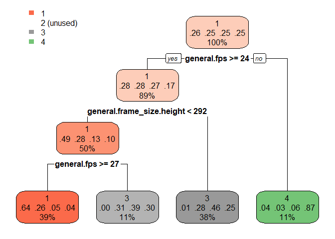<!-- -->

```r
tree_color = rpart(quartis ~ 
                     dominant_color.histogram_0 +
                     dominant_color.histogram_1 +
                     dominant_color.histogram_2 +
                     dominant_color.histogram_3 +
                     dominant_color.histogram_4 +
                     dominant_color.histogram_5 +
                     dominant_color.histogram_6 +
                     dominant_color.histogram_7 +
                     dominant_color.histogram_8 +
                     dominant_color.histogram_9 +
                     dominant_color.value, data=train, method = 'class')
rpart.plot(tree_color)
```

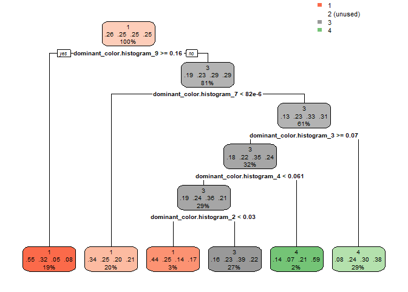<!-- -->

```r
tree_face = rpart(quartis ~ 
                    face_detection.average_face2frame_ratio + 
                    face_detection.average_face_count_per_frame + 
                    face_detection.average_face_present, data=train, method = 'class')

rpart.plot(tree_face)
```

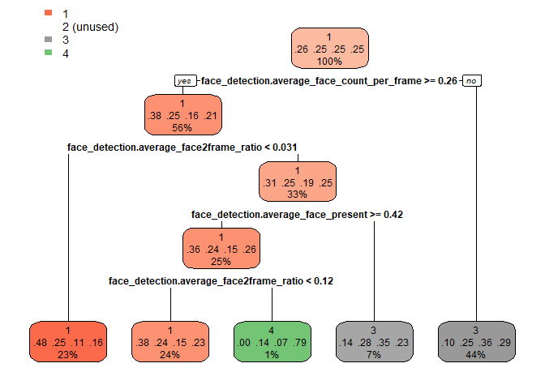<!-- -->

```r
tree_text = rpart(quartis ~ 
                    text_detection.average_text2frame_ratio +
                    text_detection.average_text_frames, data=train, method = 'class')
rpart.plot(tree_text)
```

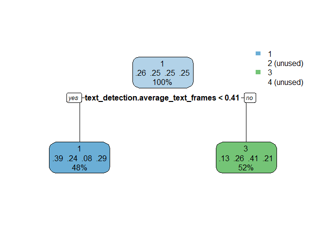<!-- -->

```r
tree_shot = rpart(quartis ~ 
                    shot_detection.average_shot_length + 
                    shot_detection.shots_count + 
                    shot_detection.transition_histogram_0 + 
                    shot_detection.transition_histogram_1, data=train, method = 'class')

rpart.plot(tree_shot)
```

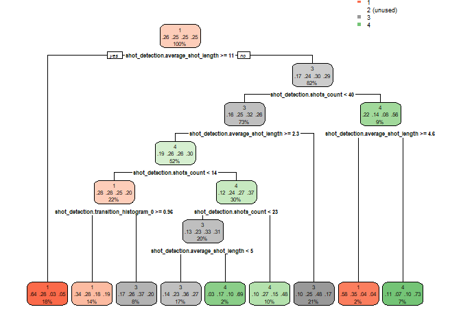<!-- -->

```r
tree_other = rpart(quartis ~ 
                     other.average_movie_speed +
                     other.clutter_metric +
                     rigidity.average_rigidity, data=train, method = 'class')

rpart.plot(tree_other)
```

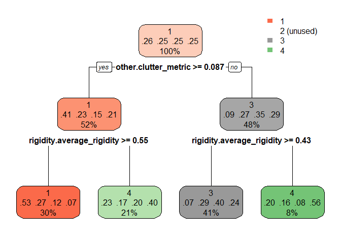<!-- -->

### Árvores de decisão para variável resposta "está no quarto quartil".


```r
tree_general_4 = rpart(quartil_4 ~ 
                     general.duration +
                     general.fps +
                     general.frame_count +
                     general.frame_size.height, data=train, method = 'class')
rpart.plot(tree_general_4)
```

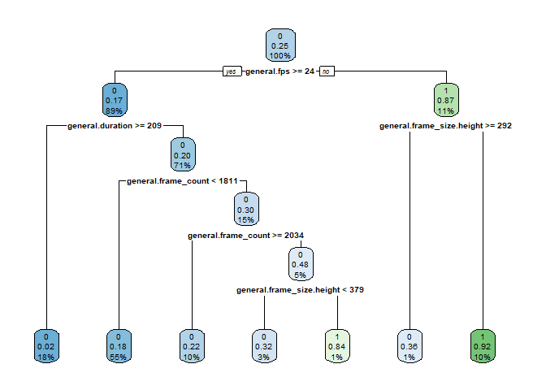<!-- -->

```r
tree_color_4 = rpart(quartil_4 ~ 
                     dominant_color.histogram_0 +
                     dominant_color.histogram_1 +
                     dominant_color.histogram_2 +
                     dominant_color.histogram_3 +
                     dominant_color.histogram_4 +
                     dominant_color.histogram_5 +
                     dominant_color.histogram_6 +
                     dominant_color.histogram_7 +
                     dominant_color.histogram_8 +
                     dominant_color.histogram_9 +
                     dominant_color.value, data=train, method = 'class')
rpart.plot(tree_color_4)
```

<!-- -->

```r
tree_face_4 = rpart(quartil_4 ~ 
                    face_detection.average_face2frame_ratio + 
                    face_detection.average_face_count_per_frame + 
                    face_detection.average_face_present, data=train, method = 'class')

rpart.plot(tree_face_4)
```

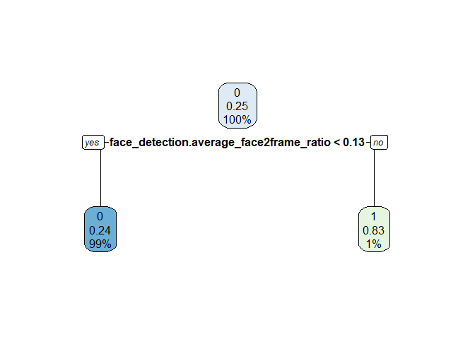<!-- -->

```r
tree_text_4 = rpart(quartil_4 ~ 
                    text_detection.average_text2frame_ratio +
                    text_detection.average_text_frames, data=train, method = 'class')
rpart.plot(tree_text_4)
```

<!-- -->

```r
tree_shot_4 = rpart(quartil_4 ~ 
                    shot_detection.average_shot_length + 
                    shot_detection.shots_count + 
                    shot_detection.transition_histogram_0 + 
                    shot_detection.transition_histogram_1, data=train, method = 'class')
rpart.plot(tree_shot_4)
```

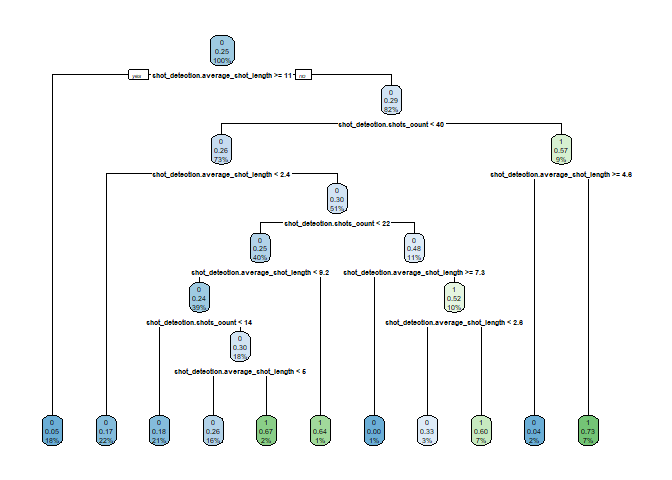<!-- -->

```r
tree_other_4 = rpart(quartil_4 ~ 
                     other.average_movie_speed +
                     other.clutter_metric +
                     rigidity.average_rigidity, data=train, method = 'class')
rpart.plot(tree_other_4)
```

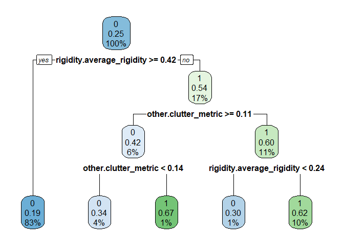<!-- -->

### Árvores de decisão para variável resposta "maior que 1 milhão de views".


```r
tree_general_1m = rpart(maior_1m ~ 
                     general.duration +
                     general.fps +
                     general.frame_count +
                     general.frame_size.height, data=train, method = 'class')
rpart.plot(tree_general_1m)
```

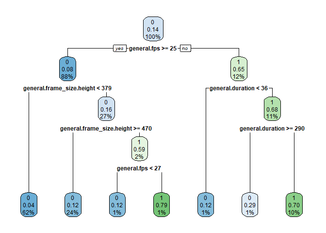<!-- -->

```r
tree_color_1m = rpart(maior_1m ~ 
                     dominant_color.histogram_0 +
                     dominant_color.histogram_1 +
                     dominant_color.histogram_2 +
                     dominant_color.histogram_3 +
                     dominant_color.histogram_4 +
                     dominant_color.histogram_5 +
                     dominant_color.histogram_6 +
                     dominant_color.histogram_7 +
                     dominant_color.histogram_8 +
                     dominant_color.histogram_9 +
                     dominant_color.value, data=train, method = 'class')
rpart.plot(tree_color_1m)
```

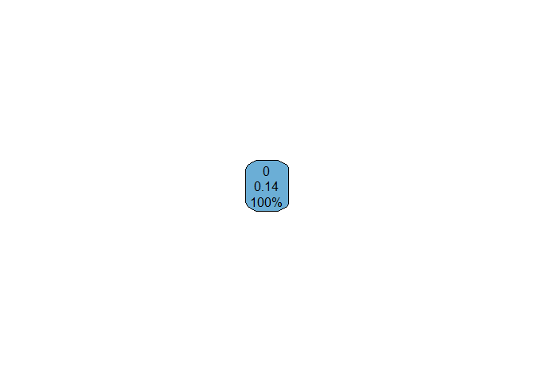<!-- -->

```r
tree_face_1m = rpart(maior_1m ~ 
                    face_detection.average_face2frame_ratio + 
                    face_detection.average_face_count_per_frame + 
                    face_detection.average_face_present, data=train, method = 'class')
rpart.plot(tree_face_1m)
```

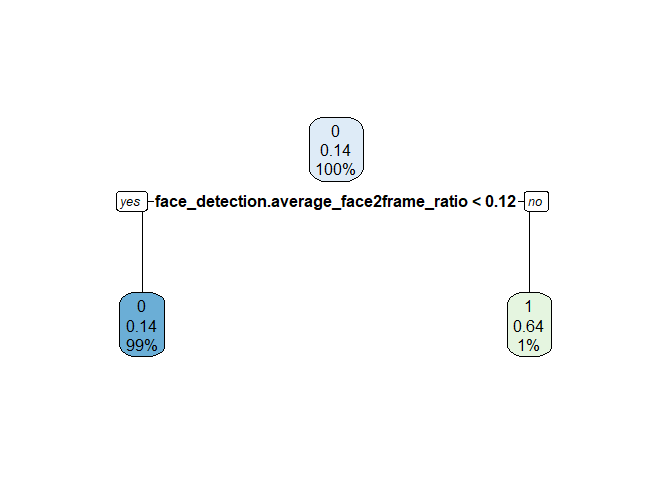<!-- -->

```r
tree_text_1m = rpart(maior_1m ~ 
                    text_detection.average_text2frame_ratio +
                    text_detection.average_text_frames, data=train, method = 'class')
rpart.plot(tree_text_1m)
```

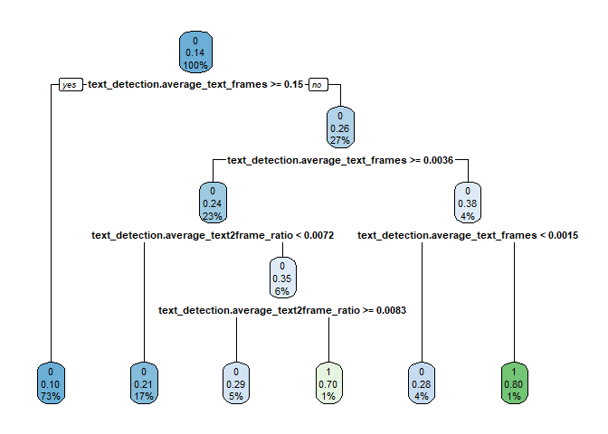<!-- -->

```r
tree_shot_1m = rpart(maior_1m ~ 
                    shot_detection.average_shot_length + 
                    shot_detection.shots_count + 
                    shot_detection.transition_histogram_0 + 
                    shot_detection.transition_histogram_1, data=train, method = 'class')
rpart.plot(tree_shot_1m)
```

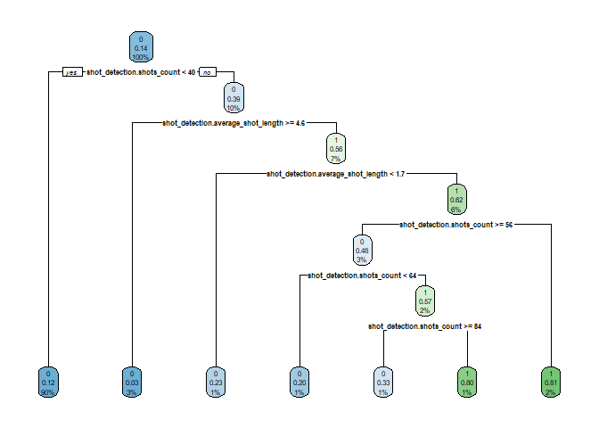<!-- -->

```r
tree_other_1m = rpart(maior_1m ~ 
                     other.average_movie_speed +
                     other.clutter_metric +
                     rigidity.average_rigidity, data=train, method = 'class')
rpart.plot(tree_other_1m)
```

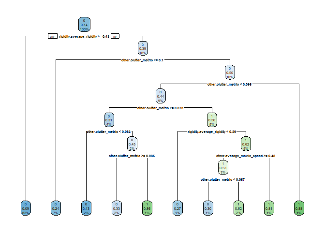<!-- -->

# Modeling

## Random Forest

### Testando com a variável resposta "quartis", conde cada quartil é uma categoria.


```r
# Create a Random Forest model with default parameters
model_default_quartis <- randomForest(quartis ~ 
                         general.duration +
                         general.fps +
                         general.frame_count +
                         general.frame_size.height+
                         dominant_color.histogram_0 +
                         dominant_color.histogram_1 +
                         dominant_color.histogram_2 +
                         dominant_color.histogram_3 +
                         dominant_color.histogram_4 +
                         dominant_color.histogram_5 +
                         dominant_color.histogram_6 +
                         dominant_color.histogram_7 +
                         dominant_color.histogram_8 +
                         dominant_color.histogram_9 +
                         dominant_color.value +
                         face_detection.average_face2frame_ratio + 
                         face_detection.average_face_count_per_frame + 
                         face_detection.average_face_present+
                         text_detection.average_text2frame_ratio +
                         text_detection.average_text_frames+
                         shot_detection.average_shot_length + 
                         shot_detection.shots_count + 
                         shot_detection.transition_histogram_0 + 
                         shot_detection.transition_histogram_1+
                         other.average_movie_speed +
                         other.clutter_metric +
                         rigidity.average_rigidity, data = train, importance = TRUE)
model_default_quartis
```

```
## 
## Call:
##  randomForest(formula = quartis ~ general.duration + general.fps +      general.frame_count + general.frame_size.height + dominant_color.histogram_0 +      dominant_color.histogram_1 + dominant_color.histogram_2 +      dominant_color.histogram_3 + dominant_color.histogram_4 +      dominant_color.histogram_5 + dominant_color.histogram_6 +      dominant_color.histogram_7 + dominant_color.histogram_8 +      dominant_color.histogram_9 + dominant_color.value + face_detection.average_face2frame_ratio +      face_detection.average_face_count_per_frame + face_detection.average_face_present +      text_detection.average_text2frame_ratio + text_detection.average_text_frames +      shot_detection.average_shot_length + shot_detection.shots_count +      shot_detection.transition_histogram_0 + shot_detection.transition_histogram_1 +      other.average_movie_speed + other.clutter_metric + rigidity.average_rigidity,      data = train, importance = TRUE) 
##                Type of random forest: classification
##                      Number of trees: 500
## No. of variables tried at each split: 5
## 
##         OOB estimate of  error rate: 42.78%
## Confusion matrix:
##     1  2   3   4 class.error
## 1 291 23   4   7   0.1046154
## 2 120 58 104  36   0.8176101
## 3  19 47 213  38   0.3280757
## 4  16 27 104 167   0.4681529
```

```r
# To check important variables
importance(model_default_quartis)        
```

```
##                                                      1           2
## general.duration                            15.7387948 -1.31846351
## general.fps                                 31.1400723  9.31511331
## general.frame_count                         15.2528669 -2.86868440
## general.frame_size.height                   29.8200224  5.46451071
## dominant_color.histogram_0                  -1.0681980  0.17029855
## dominant_color.histogram_1                   1.7008978  0.03069920
## dominant_color.histogram_2                   9.2336150 -1.58541276
## dominant_color.histogram_3                   0.6809216 -0.04783865
## dominant_color.histogram_4                   0.1232645 -0.70119220
## dominant_color.histogram_5                  -0.7749408 -2.17671706
## dominant_color.histogram_6                   2.4059161 -0.53984142
## dominant_color.histogram_7                   8.0516055 -2.15638557
## dominant_color.histogram_8                  -3.0710152  5.49748483
## dominant_color.histogram_9                  -7.1299606  5.20962358
## dominant_color.value                         5.5742027 -0.52685247
## face_detection.average_face2frame_ratio      3.9802755 -1.27526193
## face_detection.average_face_count_per_frame  8.8367154 -1.99940883
## face_detection.average_face_present          9.9070230 -4.17321544
## text_detection.average_text2frame_ratio     12.2567602 -2.32073415
## text_detection.average_text_frames          12.3528217 -6.26630773
## shot_detection.average_shot_length          10.5634238 -2.22211723
## shot_detection.shots_count                  10.8990093 -2.70189993
## shot_detection.transition_histogram_0        3.0519052  1.34912996
## shot_detection.transition_histogram_1        1.6757360  1.51326658
## other.average_movie_speed                   12.9380725 -2.75961921
## other.clutter_metric                        16.4215820 -3.24100508
## rigidity.average_rigidity                    6.1347493 -2.12135804
##                                                        3          4
## general.duration                            14.908832900 10.8682248
## general.fps                                 19.490080422 42.8916189
## general.frame_count                         15.454360332 11.0608004
## general.frame_size.height                   23.778943196 17.4550165
## dominant_color.histogram_0                   3.320445943  4.6205056
## dominant_color.histogram_1                   2.521143391  1.5763121
## dominant_color.histogram_2                   5.447988215 -4.2976051
## dominant_color.histogram_3                   0.003384773  7.1201961
## dominant_color.histogram_4                   4.111672595  0.4439721
## dominant_color.histogram_5                   4.770408329 -0.2060797
## dominant_color.histogram_6                  -1.011454934  7.1278930
## dominant_color.histogram_7                   4.051742095  0.9308834
## dominant_color.histogram_8                   1.281083246  0.9145447
## dominant_color.histogram_9                   3.965457074  3.6788701
## dominant_color.value                         3.427930094  2.6683997
## face_detection.average_face2frame_ratio      4.817240726  2.0230392
## face_detection.average_face_count_per_frame  8.151092971  1.7402620
## face_detection.average_face_present          6.607068649  5.9502534
## text_detection.average_text2frame_ratio      8.783105827 10.0014330
## text_detection.average_text_frames          16.727319715 14.9659174
## shot_detection.average_shot_length          14.317869521  6.5977698
## shot_detection.shots_count                   4.929651423  5.8199863
## shot_detection.transition_histogram_0        2.790098487  2.5360129
## shot_detection.transition_histogram_1        3.056974611  2.2522460
## other.average_movie_speed                    0.811627098  5.5171727
## other.clutter_metric                         5.765085628  3.9987655
## rigidity.average_rigidity                    8.509931808  9.2985307
##                                             MeanDecreaseAccuracy
## general.duration                                      20.8843066
## general.fps                                           46.1356237
## general.frame_count                                   20.4146472
## general.frame_size.height                             32.3622551
## dominant_color.histogram_0                             3.0334951
## dominant_color.histogram_1                             3.0699582
## dominant_color.histogram_2                             6.7011515
## dominant_color.histogram_3                             3.8588808
## dominant_color.histogram_4                             2.1561680
## dominant_color.histogram_5                             1.4596827
## dominant_color.histogram_6                             3.7879599
## dominant_color.histogram_7                             6.4723935
## dominant_color.histogram_8                             2.6479930
## dominant_color.histogram_9                             0.9906116
## dominant_color.value                                   6.2512086
## face_detection.average_face2frame_ratio                5.7457440
## face_detection.average_face_count_per_frame           10.2221230
## face_detection.average_face_present                   10.2892228
## text_detection.average_text2frame_ratio               16.2966082
## text_detection.average_text_frames                    21.7586332
## shot_detection.average_shot_length                    16.5355885
## shot_detection.shots_count                            10.0170765
## shot_detection.transition_histogram_0                  5.2471338
## shot_detection.transition_histogram_1                  4.4967010
## other.average_movie_speed                              9.9018981
## other.clutter_metric                                  13.6246786
## rigidity.average_rigidity                             11.6527971
##                                             MeanDecreaseGini
## general.duration                                   57.238402
## general.fps                                        70.210866
## general.frame_count                                61.438087
## general.frame_size.height                          46.177718
## dominant_color.histogram_0                         14.281010
## dominant_color.histogram_1                         35.692267
## dominant_color.histogram_2                         35.624507
## dominant_color.histogram_3                         31.701861
## dominant_color.histogram_4                         14.359293
## dominant_color.histogram_5                          9.957348
## dominant_color.histogram_6                         16.581879
## dominant_color.histogram_7                         30.211317
## dominant_color.histogram_8                         25.609507
## dominant_color.histogram_9                         26.816897
## dominant_color.value                               26.466361
## face_detection.average_face2frame_ratio            31.575276
## face_detection.average_face_count_per_frame        34.495075
## face_detection.average_face_present                35.412530
## text_detection.average_text2frame_ratio            45.099657
## text_detection.average_text_frames                 56.741473
## shot_detection.average_shot_length                 48.641473
## shot_detection.shots_count                         33.207164
## shot_detection.transition_histogram_0              19.060199
## shot_detection.transition_histogram_1              17.964388
## other.average_movie_speed                          39.828752
## other.clutter_metric                               44.528213
## rigidity.average_rigidity                          44.536141
```

```r
varImpPlot(model_default_quartis)
```

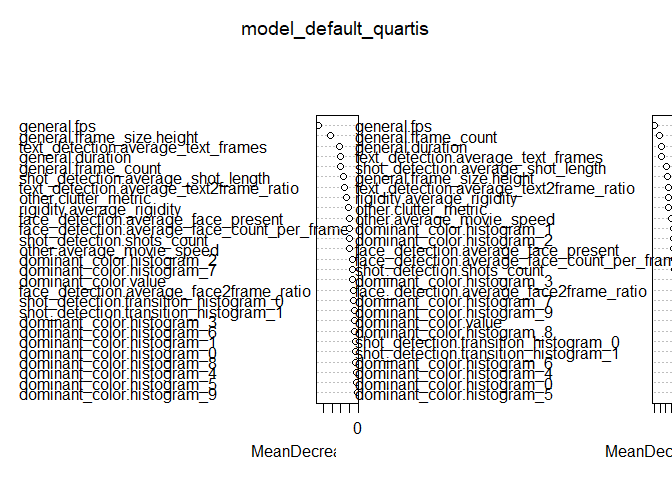<!-- -->

```r
# Predicting on train set
predTrain_quartis <- predict(model_default_quartis, train, type = "class")
# Checking classification accuracy
table(predTrain_quartis, train$quartis)  
```

```
##                  
## predTrain_quartis   1   2   3   4
##                 1 325   0   0   0
##                 2   0 317   0   0
##                 3   0   1 317   0
##                 4   0   0   0 314
```

```r
# Predicting on test set
predValid_quartis <- predict(model_default_quartis, test, type = "class")
# Checking classification accuracy
table(predValid_quartis, test$quartis)
```

```
##                  
## predValid_quartis   1   2   3   4
##                 1 119  67  10   8
##                 2   6  23  21  11
##                 3   2  33  82  43
##                 4   3  14  25  79
```

```r
mean(predValid_quartis == test$quartis)
```

```
## [1] 0.5549451
```

### Testando com a variável resposta "estar no quarto quartil".


```r
# Create a Random Forest model with default parameters
model_default_quartil4 <- randomForest(quartil_4 ~ 
                         general.duration +
                         general.fps +
                         general.frame_count +
                         general.frame_size.height+
                         dominant_color.histogram_0 +
                         dominant_color.histogram_1 +
                         dominant_color.histogram_2 +
                         dominant_color.histogram_3 +
                         dominant_color.histogram_4 +
                         dominant_color.histogram_5 +
                         dominant_color.histogram_6 +
                         dominant_color.histogram_7 +
                         dominant_color.histogram_8 +
                         dominant_color.histogram_9 +
                         dominant_color.value +
                         face_detection.average_face2frame_ratio + 
                         face_detection.average_face_count_per_frame + 
                         face_detection.average_face_present+
                         text_detection.average_text2frame_ratio +
                         text_detection.average_text_frames+
                         shot_detection.average_shot_length + 
                         shot_detection.shots_count + 
                         shot_detection.transition_histogram_0 + 
                         shot_detection.transition_histogram_1+
                         other.average_movie_speed +
                         other.clutter_metric +
                         rigidity.average_rigidity, data = train, importance = TRUE)
model_default_quartil4
```

```
## 
## Call:
##  randomForest(formula = quartil_4 ~ general.duration + general.fps +      general.frame_count + general.frame_size.height + dominant_color.histogram_0 +      dominant_color.histogram_1 + dominant_color.histogram_2 +      dominant_color.histogram_3 + dominant_color.histogram_4 +      dominant_color.histogram_5 + dominant_color.histogram_6 +      dominant_color.histogram_7 + dominant_color.histogram_8 +      dominant_color.histogram_9 + dominant_color.value + face_detection.average_face2frame_ratio +      face_detection.average_face_count_per_frame + face_detection.average_face_present +      text_detection.average_text2frame_ratio + text_detection.average_text_frames +      shot_detection.average_shot_length + shot_detection.shots_count +      shot_detection.transition_histogram_0 + shot_detection.transition_histogram_1 +      other.average_movie_speed + other.clutter_metric + rigidity.average_rigidity,      data = train, importance = TRUE) 
##                Type of random forest: classification
##                      Number of trees: 500
## No. of variables tried at each split: 5
## 
##         OOB estimate of  error rate: 15.15%
## Confusion matrix:
##     0   1 class.error
## 0 941  19  0.01979167
## 1 174 140  0.55414013
```

```r
# To check important variables
importance(model_default_quartil4)        
```

```
##                                                     0          1
## general.duration                            18.261086  3.0208174
## general.fps                                 35.463541 39.4827417
## general.frame_count                         17.573750  3.6642037
## general.frame_size.height                   10.034145  9.2103168
## dominant_color.histogram_0                   6.107792  3.1550848
## dominant_color.histogram_1                   7.035591  2.3139381
## dominant_color.histogram_2                  12.414885 -4.6524412
## dominant_color.histogram_3                   5.255419  5.8650196
## dominant_color.histogram_4                   2.675604 -0.1064812
## dominant_color.histogram_5                   2.072812 -1.2861108
## dominant_color.histogram_6                  -2.896914  7.8210179
## dominant_color.histogram_7                   9.919379  0.5624374
## dominant_color.histogram_8                   3.742784  1.3540239
## dominant_color.histogram_9                  10.518622  0.9298927
## dominant_color.value                         9.691123  1.7014731
## face_detection.average_face2frame_ratio     11.811224 -2.8771912
## face_detection.average_face_count_per_frame 13.231798 -5.8708478
## face_detection.average_face_present         13.522833 -0.2808946
## text_detection.average_text2frame_ratio     12.139356  4.1898491
## text_detection.average_text_frames          10.067967  9.0969389
## shot_detection.average_shot_length          12.913921  4.3840224
## shot_detection.shots_count                  14.558669  1.3497166
## shot_detection.transition_histogram_0        8.485578 -1.5707115
## shot_detection.transition_histogram_1        7.133581 -2.3539033
## other.average_movie_speed                    5.054380  3.9232772
## other.clutter_metric                        11.230755  1.5117451
## rigidity.average_rigidity                   11.805888 11.1904941
##                                             MeanDecreaseAccuracy
## general.duration                                       20.178227
## general.fps                                            44.906296
## general.frame_count                                    19.256469
## general.frame_size.height                              12.248911
## dominant_color.histogram_0                              6.832404
## dominant_color.histogram_1                              7.569963
## dominant_color.histogram_2                             10.006268
## dominant_color.histogram_3                              7.683002
## dominant_color.histogram_4                              2.252272
## dominant_color.histogram_5                              1.363253
## dominant_color.histogram_6                              2.156446
## dominant_color.histogram_7                              9.155648
## dominant_color.histogram_8                              3.968402
## dominant_color.histogram_9                             10.129949
## dominant_color.value                                    9.852948
## face_detection.average_face2frame_ratio                11.585643
## face_detection.average_face_count_per_frame            13.132199
## face_detection.average_face_present                    14.229404
## text_detection.average_text2frame_ratio                13.086855
## text_detection.average_text_frames                     13.993700
## shot_detection.average_shot_length                     14.323092
## shot_detection.shots_count                             14.543896
## shot_detection.transition_histogram_0                   7.891499
## shot_detection.transition_histogram_1                   6.023535
## other.average_movie_speed                               6.562688
## other.clutter_metric                                   11.469240
## rigidity.average_rigidity                              15.829258
##                                             MeanDecreaseGini
## general.duration                                   27.392172
## general.fps                                        71.179791
## general.frame_count                                26.835280
## general.frame_size.height                           7.136151
## dominant_color.histogram_0                          5.565476
## dominant_color.histogram_1                         17.213203
## dominant_color.histogram_2                         16.915940
## dominant_color.histogram_3                         16.700554
## dominant_color.histogram_4                          7.250565
## dominant_color.histogram_5                          3.257178
## dominant_color.histogram_6                         10.136064
## dominant_color.histogram_7                         13.458256
## dominant_color.histogram_8                         11.262129
## dominant_color.histogram_9                         11.132814
## dominant_color.value                               13.857649
## face_detection.average_face2frame_ratio            16.272560
## face_detection.average_face_count_per_frame        14.674754
## face_detection.average_face_present                15.710795
## text_detection.average_text2frame_ratio            19.205024
## text_detection.average_text_frames                 25.058356
## shot_detection.average_shot_length                 19.664959
## shot_detection.shots_count                         17.949659
## shot_detection.transition_histogram_0               8.432023
## shot_detection.transition_histogram_1               8.617322
## other.average_movie_speed                          18.963300
## other.clutter_metric                               17.590811
## rigidity.average_rigidity                          31.911148
```

```r
varImpPlot(model_default_quartil4)
```

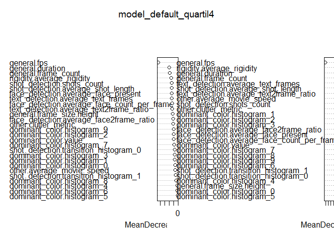<!-- -->

```r
# Predicting on train set
predTrain_quartil4 <- predict(model_default_quartil4, train, type = "class")
# Checking classification accuracy
table(predTrain_quartil4, train$quartil_4)
```

```
##                   
## predTrain_quartil4   0   1
##                  0 960   0
##                  1   0 314
```

```r
# Predicting on test set
predValid_quartil4 <- predict(model_default_quartil4, test, type = "class")
# Checking classification accuracy
table(predValid_quartil4, test$quartil_4)  
```

```
##                   
## predValid_quartil4   0   1
##                  0 393  76
##                  1  12  65
```

```r
mean(predValid_quartil4 == test$quartil_4)
```

```
## [1] 0.8388278
```

### Testando com a variável resposta sendo "mais de 500 mil views".


```r
# Create a Random Forest model with default parameters
model_random_forest <- randomForest(maior_500k ~ 
                         general.duration +
                         general.fps +
                         general.frame_count +
                         general.frame_size.height+
                         dominant_color.histogram_0 +
                         dominant_color.histogram_1 +
                         dominant_color.histogram_2 +
                         dominant_color.histogram_3 +
                         dominant_color.histogram_4 +
                         dominant_color.histogram_5 +
                         dominant_color.histogram_6 +
                         dominant_color.histogram_7 +
                         dominant_color.histogram_8 +
                         dominant_color.histogram_9 +
                         dominant_color.value +
                         face_detection.average_face2frame_ratio + 
                         face_detection.average_face_count_per_frame + 
                         face_detection.average_face_present+
                         text_detection.average_text2frame_ratio +
                         text_detection.average_text_frames+
                         shot_detection.average_shot_length + 
                         shot_detection.shots_count + 
                         shot_detection.transition_histogram_0 + 
                         shot_detection.transition_histogram_1+
                         other.average_movie_speed +
                         other.clutter_metric +
                         rigidity.average_rigidity, data = train, importance = TRUE)
# model_random_forest
# 
# # To check important variables
# importance(model_random_forest)      
# varImpPlot(model_random_forest)

# Predicting on test set
test_pred_random_forest <- predict(model_random_forest, test, type = "class")

# Checking classification metrics
confusion_matrix_random_forest <- table(test_pred_random_forest, test$maior_500k)
confusion_matrix_random_forest
```

```
##                        
## test_pred_random_forest   0   1
##                       0 404  68
##                       1  12  62
```

```r
metrics(confusion_matrix_random_forest)
```

```
## [1] "Accuracy: 0.85348"
```

```
##   precision    recall        f1
## 0 0.9711538 0.8559322 0.9099099
## 1 0.4769231 0.8378378 0.6078431
```


### Variable selection

A princípio, o modelo default que mais se saiu bem foi o que utiliza a variável resposta como sendo o vídeo ter mais de 1 milhão de views.

Abaixo o teste fazendo uma seleção manual de variáveis.


```r
# Create a Random Forest model with default parameters
model_rf_selection <- randomForest(maior_500k ~ 
                         general.duration +
                         general.fps +
                         general.frame_count +
                         general.frame_size.height+
                         # dominant_color.histogram_0 +
                         # dominant_color.histogram_1 +
                         dominant_color.histogram_2 +
                         # dominant_color.histogram_3 +
                         # dominant_color.histogram_4 +
                         # dominant_color.histogram_5 +
                         # dominant_color.histogram_6 +
                         dominant_color.histogram_7 +
                         # dominant_color.histogram_8 +
                         # dominant_color.histogram_9 +
                         dominant_color.value +
                         face_detection.average_face2frame_ratio + 
                         face_detection.average_face_count_per_frame + 
                         face_detection.average_face_present+
                         text_detection.average_text2frame_ratio +
                         text_detection.average_text_frames+
                         shot_detection.average_shot_length + 
                         shot_detection.shots_count +
                         # shot_detection.transition_histogram_0 + 
                         # shot_detection.transition_histogram_1 +
                         # other.average_movie_speed +
                         other.clutter_metric +
                         rigidity.average_rigidity, data = train, 
                         importance = TRUE, mtry = 6)
# model_rf_selection
# 
# # To check important variables
# importance(model_rf_selection)
# varImpPlot(model_rf_selection)

# Predicting on test set
test_pred_rf_selecion <- predict(model_rf_selection, test, type = "class")

# Checking classification metrics
confusion_matrix_rf_selecion <- table(test_pred_rf_selecion, test$maior_500k)
confusion_matrix_rf_selecion
```

```
##                      
## test_pred_rf_selecion   0   1
##                     0 400  69
##                     1  16  61
```

```r
metrics(confusion_matrix_rf_selecion)
```

```
## [1] "Accuracy: 0.844322"
```

```
##   precision    recall        f1
## 0 0.9615385 0.8528785 0.9039548
## 1 0.4692308 0.7922078 0.5893720
```

## Cross validation

Agora, tunando o parâmetro mtry da Random Forest e utilizando croos validation com k = 5 folders.


```r
# 5 folds
tr <- trainControl(method = "cv", number = 5)

model_rf_crossvalidation <- train(maior_500k ~ 
                         general.duration +
                         general.fps +
                         general.frame_count +
                         general.frame_size.height +
                         # dominant_color.histogram_0 +
                         # dominant_color.histogram_1 +
                         # dominant_color.histogram_2 +
                         dominant_color.histogram_3 +
                         # dominant_color.histogram_4 +
                         # dominant_color.histogram_5 +
                         # dominant_color.histogram_6 +
                         dominant_color.histogram_7 +
                         # dominant_color.histogram_8 +
                         # dominant_color.histogram_9 +
                         # dominant_color.value +
                         face_detection.average_face2frame_ratio + 
                         face_detection.average_face_count_per_frame + 
                         face_detection.average_face_present +
                         text_detection.average_text2frame_ratio +
                         text_detection.average_text_frames +
                         shot_detection.average_shot_length + 
                         shot_detection.shots_count +
                         # shot_detection.transition_histogram_0 +
                         # shot_detection.transition_histogram_1 +
                         # other.average_movie_speed +
                         other.clutter_metric +
                         rigidity.average_rigidity,
                         data = train, method = "rf", trControl = tr)

# model_rf_crossvalidation
# 
# 
# # To check important variables
# importance(model_rf_crossvalidation$finalModel)
varImpPlot(model_rf_crossvalidation$finalModel)
```

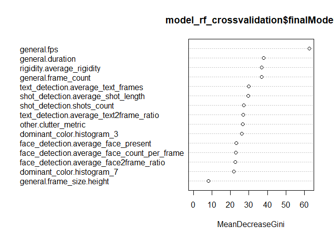<!-- -->

```r
# Predicting on test set
test_pred_rf_crossvalidation <- predict(model_rf_crossvalidation$finalModel, test, type = "class")

# Checking classification metrics
confusion_matrix_rf_crossvalidation <- table(test_pred_rf_crossvalidation, test$maior_500k)  
confusion_matrix_rf_crossvalidation
```

```
##                             
## test_pred_rf_crossvalidation   0   1
##                            0 406  67
##                            1  10  63
```

```r
metrics(confusion_matrix_rf_crossvalidation)
```

```
## [1] "Accuracy: 0.858974"
```

```
##   precision    recall        f1
## 0 0.9759615 0.8583510 0.9133858
## 1 0.4846154 0.8630137 0.6206897
```

### Paper technique


```r
# Support Vector Machine Radial
model_cv_svm_radial <- train(maior_500k ~ 
                         general.duration +
                         general.fps +
                         general.frame_count +
                         general.frame_size.height +
                         # dominant_color.histogram_0 +
                         # dominant_color.histogram_1 +
                         # dominant_color.histogram_2 +
                         dominant_color.histogram_3 +
                         # dominant_color.histogram_4 +
                         # dominant_color.histogram_5 +
                         # dominant_color.histogram_6 +
                         dominant_color.histogram_7 +
                         # dominant_color.histogram_8 +
                         # dominant_color.histogram_9 +
                         # dominant_color.value +
                         face_detection.average_face2frame_ratio + 
                         face_detection.average_face_count_per_frame + 
                         face_detection.average_face_present +
                         text_detection.average_text2frame_ratio +
                         text_detection.average_text_frames +
                         shot_detection.average_shot_length + 
                         shot_detection.shots_count +
                         # shot_detection.transition_histogram_0 + 
                         # shot_detection.transition_histogram_1 +
                         # other.average_movie_speed +
                         other.clutter_metric +
                         rigidity.average_rigidity,
                         data = train, method = "svmRadial", trControl = tr)

# model_cv_svm_radial


# Predicting o test set
test_pred_svm_radial <- predict(model_cv_svm_radial, test)

# Checking classification metrics
confusion_matrix_svm_radial <- confusionMatrix(test_pred_svm_radial, test$maior_500k)
confusion_matrix_svm_radial
```

```
## Confusion Matrix and Statistics
## 
##           Reference
## Prediction   0   1
##          0 407  73
##          1   9  57
##                                            
##                Accuracy : 0.8498           
##                  95% CI : (0.817, 0.8787)  
##     No Information Rate : 0.7619           
##     P-Value [Acc > NIR] : 0.000000272748962
##                                            
##                   Kappa : 0.5017           
##                                            
##  Mcnemar's Test P-Value : 0.000000000003471
##                                            
##             Sensitivity : 0.9784           
##             Specificity : 0.4385           
##          Pos Pred Value : 0.8479           
##          Neg Pred Value : 0.8636           
##              Prevalence : 0.7619           
##          Detection Rate : 0.7454           
##    Detection Prevalence : 0.8791           
##       Balanced Accuracy : 0.7084           
##                                            
##        'Positive' Class : 0                
## 
```

```r
metrics(as.matrix(confusion_matrix_svm_radial$table))
```

```
## [1] "Accuracy: 0.849817"
```

```
##   precision    recall        f1
## 0 0.9783654 0.8479167 0.9084821
## 1 0.4384615 0.8636364 0.5816327
```

### Other models

Ajustando outros modelos de machine larning para comparação.


```r
# Support Vector Machine Linear
model_cv_svm_linear <- train(maior_500k ~ 
                         general.duration +
                         general.fps +
                         general.frame_count +
                         general.frame_size.height +
                         # dominant_color.histogram_0 +
                         # dominant_color.histogram_1 +
                         # dominant_color.histogram_2 +
                         dominant_color.histogram_3 +
                         # dominant_color.histogram_4 +
                         # dominant_color.histogram_5 +
                         # dominant_color.histogram_6 +
                         dominant_color.histogram_7 +
                         # dominant_color.histogram_8 +
                         # dominant_color.histogram_9 +
                         # dominant_color.value +
                         face_detection.average_face2frame_ratio + 
                         face_detection.average_face_count_per_frame + 
                         face_detection.average_face_present +
                         text_detection.average_text2frame_ratio +
                         text_detection.average_text_frames +
                         shot_detection.average_shot_length + 
                         shot_detection.shots_count +
                         # shot_detection.transition_histogram_0 + 
                         # shot_detection.transition_histogram_1 +
                         # other.average_movie_speed +
                         other.clutter_metric +
                         rigidity.average_rigidity,
                         data = train, method = "svmLinear", trControl = tr)

# model_cv_svm_linear

# Predicting on test set
test_pred_svm_linear <- predict(model_cv_svm_linear, test)
# Checking classification metrics

confusion_matrix_svm_linear <- confusionMatrix(test_pred_svm_linear, test$maior_500k)
confusion_matrix_svm_linear
```

```
## Confusion Matrix and Statistics
## 
##           Reference
## Prediction   0   1
##          0 350  54
##          1  66  76
##                                           
##                Accuracy : 0.7802          
##                  95% CI : (0.7431, 0.8143)
##     No Information Rate : 0.7619          
##     P-Value [Acc > NIR] : 0.1701          
##                                           
##                   Kappa : 0.4129          
##                                           
##  Mcnemar's Test P-Value : 0.3153          
##                                           
##             Sensitivity : 0.8413          
##             Specificity : 0.5846          
##          Pos Pred Value : 0.8663          
##          Neg Pred Value : 0.5352          
##              Prevalence : 0.7619          
##          Detection Rate : 0.6410          
##    Detection Prevalence : 0.7399          
##       Balanced Accuracy : 0.7130          
##                                           
##        'Positive' Class : 0               
## 
```

```r
metrics(as.matrix(confusion_matrix_svm_linear$table))
```

```
## [1] "Accuracy: 0.78022"
```

```
##   precision    recall        f1
## 0 0.8413462 0.8663366 0.8536585
## 1 0.5846154 0.5352113 0.5588235
```

```r
# # Tree Bag
# model_crossvalidation_treebag <- train(maior_1m ~
#                          general.duration +
#                          general.fps +
#                          general.frame_count +
#                          general.frame_size.height +
#                          # dominant_color.histogram_0 +
#                          # dominant_color.histogram_1 +
#                          # dominant_color.histogram_2 +
#                          dominant_color.histogram_3 +
#                          # dominant_color.histogram_4 +
#                          # dominant_color.histogram_5 +
#                          # dominant_color.histogram_6 +
#                          dominant_color.histogram_7 +
#                          # dominant_color.histogram_8 +
#                          # dominant_color.histogram_9 +
#                          # dominant_color.value +
#                          face_detection.average_face2frame_ratio +
#                          face_detection.average_face_count_per_frame +
#                          face_detection.average_face_present +
#                          text_detection.average_text2frame_ratio +
#                          text_detection.average_text_frames +
#                          shot_detection.average_shot_length +
#                          shot_detection.shots_count +
#                          # shot_detection.transition_histogram_0 +
#                          # shot_detection.transition_histogram_1 +
#                          # other.average_movie_speed +
#                          other.clutter_metric +
#                          rigidity.average_rigidity,
#                          data = train, method = "treebag", trControl = tr)
# 
# model_crossvalidation_treebag
```


### Testando com a variável resposta sendo "mais de 1 milhão de views".


```r
# Create a Random Forest model with default parameters
model_random_forest <- randomForest(maior_1m ~ 
                         general.duration +
                         general.fps +
                         general.frame_count +
                         general.frame_size.height+
                         dominant_color.histogram_0 +
                         dominant_color.histogram_1 +
                         dominant_color.histogram_2 +
                         dominant_color.histogram_3 +
                         dominant_color.histogram_4 +
                         dominant_color.histogram_5 +
                         dominant_color.histogram_6 +
                         dominant_color.histogram_7 +
                         dominant_color.histogram_8 +
                         dominant_color.histogram_9 +
                         # dominant_color.value +
                         face_detection.average_face2frame_ratio + 
                         face_detection.average_face_count_per_frame + 
                         face_detection.average_face_present+
                         text_detection.average_text2frame_ratio +
                         text_detection.average_text_frames+
                         shot_detection.average_shot_length + 
                         shot_detection.shots_count + 
                         shot_detection.transition_histogram_0 + 
                         shot_detection.transition_histogram_1+
                         other.average_movie_speed +
                         other.clutter_metric +
                         rigidity.average_rigidity, data = train, importance = TRUE)
# model_random_forest
# 
# # To check important variables
# importance(model_random_forest)      
# varImpPlot(model_random_forest)

# Predicting on test set
test_pred_random_forest <- predict(model_random_forest, test, type = "class")

# Checking classification metrics
confusion_matrix_random_forest <- table(test_pred_random_forest, test$maior_1m)
confusion_matrix_random_forest
```

```
##                        
## test_pred_random_forest   0   1
##                       0 456  33
##                       1  19  38
```

```r
metrics(confusion_matrix_random_forest)
```

```
## [1] "Accuracy: 0.904762"
```

```
##   precision    recall        f1
## 0 0.9600000 0.9325153 0.9460581
## 1 0.5352113 0.6666667 0.5937500
```


### Variable selection

A princípio, o modelo default que mais se saiu bem foi o que utiliza a variável resposta como sendo o vídeo ter mais de 1 milhão de views.

Abaixo o teste fazendo uma seleção manual de variáveis.


```r
# Create a Random Forest model with default parameters
model_rf_selection <- randomForest(maior_1m ~ 
                         general.duration +
                         general.fps +
                         general.frame_count +
                         general.frame_size.height+
                         # dominant_color.histogram_0 +
                         # dominant_color.histogram_1 +
                         dominant_color.histogram_2 +
                         # dominant_color.histogram_3 +
                         # dominant_color.histogram_4 +
                         # dominant_color.histogram_5 +
                         # dominant_color.histogram_6 +
                         dominant_color.histogram_7 +
                         # dominant_color.histogram_8 +
                         # dominant_color.histogram_9 +
                         dominant_color.value +
                         face_detection.average_face2frame_ratio + 
                         face_detection.average_face_count_per_frame + 
                         face_detection.average_face_present+
                         text_detection.average_text2frame_ratio +
                         text_detection.average_text_frames+
                         shot_detection.average_shot_length + 
                         shot_detection.shots_count +
                         # shot_detection.transition_histogram_0 + 
                         # shot_detection.transition_histogram_1 +
                         # other.average_movie_speed +
                         other.clutter_metric +
                         rigidity.average_rigidity, data = train, 
                         importance = TRUE, mtry = 6)
# model_rf_selection
# 
# # To check important variables
# importance(model_rf_selection)
# varImpPlot(model_rf_selection)

# Predicting on test set
test_pred_rf_selecion <- predict(model_rf_selection, test, type = "class")

# Checking classification metrics
confusion_matrix_rf_selecion <- table(test_pred_rf_selecion, test$maior_1m)
confusion_matrix_rf_selecion
```

```
##                      
## test_pred_rf_selecion   0   1
##                     0 447  35
##                     1  28  36
```

```r
metrics(confusion_matrix_rf_selecion)
```

```
## [1] "Accuracy: 0.884615"
```

```
##   precision    recall        f1
## 0 0.9410526 0.9273859 0.9341693
## 1 0.5070423 0.5625000 0.5333333
```

## Cross validation

Agora, tunando o parâmetro mtry da Random Forest e utilizando croos validation com k = 5 folders.


```r
# 5 folds
tr <- trainControl(method = "cv", number = 5)

model_rf_crossvalidation <- train(maior_1m ~ 
                         general.duration +
                         general.fps +
                         general.frame_count +
                         general.frame_size.height +
                         # dominant_color.histogram_0 +
                         # dominant_color.histogram_1 +
                         # dominant_color.histogram_2 +
                         dominant_color.histogram_3 +
                         # dominant_color.histogram_4 +
                         # dominant_color.histogram_5 +
                         # dominant_color.histogram_6 +
                         dominant_color.histogram_7 +
                         # dominant_color.histogram_8 +
                         # dominant_color.histogram_9 +
                         # dominant_color.value +
                         face_detection.average_face2frame_ratio + 
                         face_detection.average_face_count_per_frame + 
                         face_detection.average_face_present +
                         text_detection.average_text2frame_ratio +
                         text_detection.average_text_frames +
                         shot_detection.average_shot_length + 
                         shot_detection.shots_count +
                         # shot_detection.transition_histogram_0 +
                         # shot_detection.transition_histogram_1 +
                         # other.average_movie_speed +
                         other.clutter_metric +
                         rigidity.average_rigidity,
                         data = train, method = "rf", trControl = tr)

# model_rf_crossvalidation
# 
# 
# # To check important variables
# importance(model_rf_crossvalidation$finalModel)
varImpPlot(model_rf_crossvalidation$finalModel)
```

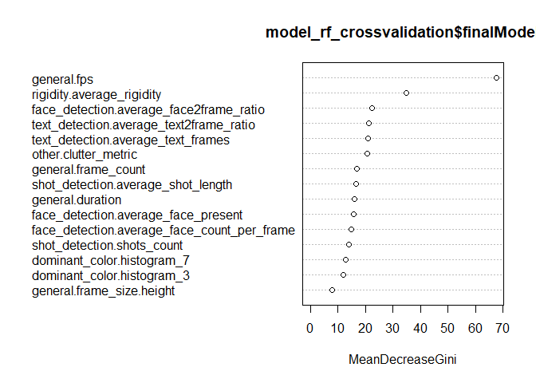<!-- -->

```r
# Predicting on test set
test_pred_rf_crossvalidation <- predict(model_rf_crossvalidation$finalModel, test, type = "class")

# Checking classification metrics
confusion_matrix_rf_crossvalidation <- table(test_pred_rf_crossvalidation, test$maior_1m)  
confusion_matrix_rf_crossvalidation
```

```
##                             
## test_pred_rf_crossvalidation   0   1
##                            0 448  34
##                            1  27  37
```

```r
metrics(confusion_matrix_rf_crossvalidation)
```

```
## [1] "Accuracy: 0.888278"
```

```
##   precision    recall        f1
## 0 0.9431579 0.9294606 0.9362591
## 1 0.5211268 0.5781250 0.5481481
```

### Paper technique


```r
# Support Vector Machine Radial
model_cv_svm_radial <- train(maior_1m ~ 
                         general.duration +
                         general.fps +
                         general.frame_count +
                         general.frame_size.height +
                         # dominant_color.histogram_0 +
                         # dominant_color.histogram_1 +
                         # dominant_color.histogram_2 +
                         dominant_color.histogram_3 +
                         # dominant_color.histogram_4 +
                         # dominant_color.histogram_5 +
                         # dominant_color.histogram_6 +
                         dominant_color.histogram_7 +
                         # dominant_color.histogram_8 +
                         # dominant_color.histogram_9 +
                         # dominant_color.value +
                         face_detection.average_face2frame_ratio + 
                         face_detection.average_face_count_per_frame + 
                         face_detection.average_face_present +
                         text_detection.average_text2frame_ratio +
                         text_detection.average_text_frames +
                         shot_detection.average_shot_length + 
                         shot_detection.shots_count +
                         # shot_detection.transition_histogram_0 + 
                         # shot_detection.transition_histogram_1 +
                         # other.average_movie_speed +
                         other.clutter_metric +
                         rigidity.average_rigidity,
                         data = train, method = "svmRadial", trControl = tr)

# model_cv_svm_radial


# Predicting o test set
test_pred_svm_radial <- predict(model_cv_svm_radial, test)

# Checking classification metrics
confusion_matrix_svm_radial <- confusionMatrix(test_pred_svm_radial, test$maior_1m)
confusion_matrix_svm_radial
```

```
## Confusion Matrix and Statistics
## 
##           Reference
## Prediction   0   1
##          0 452  36
##          1  23  35
##                                           
##                Accuracy : 0.8919          
##                  95% CI : (0.8628, 0.9167)
##     No Information Rate : 0.87            
##     P-Value [Acc > NIR] : 0.06902         
##                                           
##                   Kappa : 0.4821          
##                                           
##  Mcnemar's Test P-Value : 0.11823         
##                                           
##             Sensitivity : 0.9516          
##             Specificity : 0.4930          
##          Pos Pred Value : 0.9262          
##          Neg Pred Value : 0.6034          
##              Prevalence : 0.8700          
##          Detection Rate : 0.8278          
##    Detection Prevalence : 0.8938          
##       Balanced Accuracy : 0.7223          
##                                           
##        'Positive' Class : 0               
## 
```

```r
metrics(as.matrix(confusion_matrix_svm_radial$table))
```

```
## [1] "Accuracy: 0.891941"
```

```
##   precision    recall        f1
## 0 0.9515789 0.9262295 0.9387331
## 1 0.4929577 0.6034483 0.5426357
```

### Other models

Ajustando outros modelos de machine larning para comparação.


```r
# Support Vector Machine Linear
model_cv_svm_linear <- train(maior_1m ~ 
                         general.duration +
                         general.fps +
                         general.frame_count +
                         general.frame_size.height +
                         # dominant_color.histogram_0 +
                         # dominant_color.histogram_1 +
                         # dominant_color.histogram_2 +
                         dominant_color.histogram_3 +
                         # dominant_color.histogram_4 +
                         # dominant_color.histogram_5 +
                         # dominant_color.histogram_6 +
                         dominant_color.histogram_7 +
                         # dominant_color.histogram_8 +
                         # dominant_color.histogram_9 +
                         # dominant_color.value +
                         face_detection.average_face2frame_ratio + 
                         face_detection.average_face_count_per_frame + 
                         face_detection.average_face_present +
                         text_detection.average_text2frame_ratio +
                         text_detection.average_text_frames +
                         shot_detection.average_shot_length + 
                         shot_detection.shots_count +
                         # shot_detection.transition_histogram_0 + 
                         # shot_detection.transition_histogram_1 +
                         # other.average_movie_speed +
                         other.clutter_metric +
                         rigidity.average_rigidity,
                         data = train, method = "svmLinear", trControl = tr)

# model_cv_svm_linear

# Predicting on test set
test_pred_svm_linear <- predict(model_cv_svm_linear, test)
# Checking classification metrics

confusion_matrix_svm_linear <- confusionMatrix(test_pred_svm_linear, test$maior_1m)
confusion_matrix_svm_linear
```

```
## Confusion Matrix and Statistics
## 
##           Reference
## Prediction   0   1
##          0 466  60
##          1   9  11
##                                           
##                Accuracy : 0.8736          
##                  95% CI : (0.8428, 0.9003)
##     No Information Rate : 0.87            
##     P-Value [Acc > NIR] : 0.4303          
##                                           
##                   Kappa : 0.1958          
##                                           
##  Mcnemar's Test P-Value : 0.000000001752  
##                                           
##             Sensitivity : 0.9811          
##             Specificity : 0.1549          
##          Pos Pred Value : 0.8859          
##          Neg Pred Value : 0.5500          
##              Prevalence : 0.8700          
##          Detection Rate : 0.8535          
##    Detection Prevalence : 0.9634          
##       Balanced Accuracy : 0.5680          
##                                           
##        'Positive' Class : 0               
## 
```

```r
metrics(as.matrix(confusion_matrix_svm_linear$table))
```

```
## [1] "Accuracy: 0.873626"
```

```
##   precision    recall        f1
## 0 0.9810526 0.8859316 0.9310689
## 1 0.1549296 0.5500000 0.2417582
```


### WITHOUT Variable selection

A princípio, o modelo default que mais se saiu bem foi o que utiliza a variável resposta como sendo o vídeo ter mais de 1 milhão de views.

Abaixo o teste fazendo uma seleção manual de variáveis.


```r
# Create a Random Forest model with default parameters
model_rf_selection <- randomForest(maior_1m ~ 
                         general.duration +
                         general.fps +
                         general.frame_count +
                         general.frame_size.height+
                         dominant_color.histogram_0 +
                         dominant_color.histogram_1 +
                         dominant_color.histogram_2 +
                         dominant_color.histogram_3 +
                         dominant_color.histogram_4 +
                         dominant_color.histogram_5 +
                         dominant_color.histogram_6 +
                         dominant_color.histogram_7 +
                         dominant_color.histogram_8 +
                         dominant_color.histogram_9 +
                         dominant_color.value +
                         face_detection.average_face2frame_ratio + 
                         face_detection.average_face_count_per_frame + 
                         face_detection.average_face_present+
                         text_detection.average_text2frame_ratio +
                         text_detection.average_text_frames+
                         shot_detection.average_shot_length + 
                         shot_detection.shots_count +
                         shot_detection.transition_histogram_0 +
                         shot_detection.transition_histogram_1 +
                         other.average_movie_speed +
                         other.clutter_metric +
                         rigidity.average_rigidity, data = train, 
                         importance = TRUE, mtry = 6)
# model_rf_selection
# 
# # To check important variables
# importance(model_rf_selection)
# varImpPlot(model_rf_selection)

# Predicting on test set
test_pred_rf_selecion <- predict(model_rf_selection, test, type = "class")

# Checking classification metrics
confusion_matrix_rf_selecion <- table(test_pred_rf_selecion, test$maior_1m)
confusion_matrix_rf_selecion
```

```
##                      
## test_pred_rf_selecion   0   1
##                     0 455  32
##                     1  20  39
```

```r
metrics(confusion_matrix_rf_selecion)
```

```
## [1] "Accuracy: 0.904762"
```

```
##   precision    recall        f1
## 0 0.9578947 0.9342916 0.9459459
## 1 0.5492958 0.6610169 0.6000000
```

## Cross validation

Agora, tunando o parâmetro mtry da Random Forest e utilizando croos validation com k = 5 folders.


```r
# 5 folds
tr <- trainControl(method = "cv", number = 5)

model_rf_crossvalidation <- train(maior_1m ~ 
                         general.duration +
                         general.fps +
                         general.frame_count +
                         general.frame_size.height +
                         dominant_color.histogram_0 +
                         dominant_color.histogram_1 +
                         dominant_color.histogram_2 +
                         dominant_color.histogram_3 +
                         dominant_color.histogram_4 +
                         dominant_color.histogram_5 +
                         dominant_color.histogram_6 +
                         dominant_color.histogram_7 +
                         dominant_color.histogram_8 +
                         dominant_color.histogram_9 +
                         # dominant_color.value +
                         face_detection.average_face2frame_ratio + 
                         face_detection.average_face_count_per_frame + 
                         face_detection.average_face_present +
                         text_detection.average_text2frame_ratio +
                         text_detection.average_text_frames +
                         shot_detection.average_shot_length + 
                         shot_detection.shots_count +
                         shot_detection.transition_histogram_0 +
                         shot_detection.transition_histogram_1 +
                         other.average_movie_speed +
                         other.clutter_metric +
                         rigidity.average_rigidity,
                         data = train, method = "rf", trControl = tr)

# model_rf_crossvalidation
# 
# 
# # To check important variables
# importance(model_rf_crossvalidation$finalModel)
varImpPlot(model_rf_crossvalidation$finalModel)
```

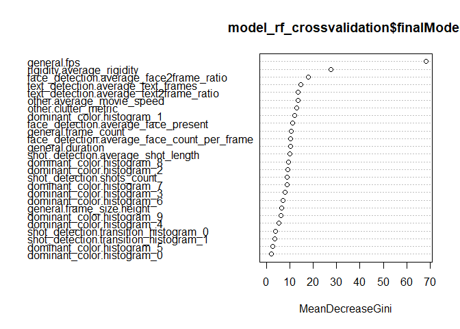<!-- -->

```r
# Predicting on test set
test_pred_rf_crossvalidation <- predict(model_rf_crossvalidation$finalModel, test, type = "class")

# Checking classification metrics
confusion_matrix_rf_crossvalidation <- table(test_pred_rf_crossvalidation, test$maior_1m)  
confusion_matrix_rf_crossvalidation
```

```
##                             
## test_pred_rf_crossvalidation   0   1
##                            0 450  33
##                            1  25  38
```

```r
metrics(confusion_matrix_rf_crossvalidation)
```

```
## [1] "Accuracy: 0.893773"
```

```
##   precision    recall        f1
## 0 0.9473684 0.9316770 0.9394572
## 1 0.5352113 0.6031746 0.5671642
```

### Paper technique


```r
# Support Vector Machine Radial
model_cv_svm_radial <- train(maior_1m ~ 
                         general.duration +
                         general.fps +
                         general.frame_count +
                         general.frame_size.height +
                         dominant_color.histogram_0 +
                         dominant_color.histogram_1 +
                         dominant_color.histogram_2 +
                         dominant_color.histogram_3 +
                         dominant_color.histogram_4 +
                         dominant_color.histogram_5 +
                         dominant_color.histogram_6 +
                         dominant_color.histogram_7 +
                         dominant_color.histogram_8 +
                         dominant_color.histogram_9 +
                         # dominant_color.value +
                         face_detection.average_face2frame_ratio + 
                         face_detection.average_face_count_per_frame + 
                         face_detection.average_face_present +
                         text_detection.average_text2frame_ratio +
                         text_detection.average_text_frames +
                         shot_detection.average_shot_length + 
                         shot_detection.shots_count +
                         shot_detection.transition_histogram_0 +
                         shot_detection.transition_histogram_1 +
                         other.average_movie_speed +
                         other.clutter_metric +
                         rigidity.average_rigidity,
                         data = train, method = "svmRadial", trControl = tr)

# model_cv_svm_radial


# Predicting o test set
test_pred_svm_radial <- predict(model_cv_svm_radial, test)

# Checking classification metrics
confusion_matrix_svm_radial <- confusionMatrix(test_pred_svm_radial, test$maior_1m)
confusion_matrix_svm_radial
```

```
## Confusion Matrix and Statistics
## 
##           Reference
## Prediction   0   1
##          0 459  39
##          1  16  32
##                                           
##                Accuracy : 0.8993          
##                  95% CI : (0.8709, 0.9232)
##     No Information Rate : 0.87            
##     P-Value [Acc > NIR] : 0.021518        
##                                           
##                   Kappa : 0.4836          
##                                           
##  Mcnemar's Test P-Value : 0.003012        
##                                           
##             Sensitivity : 0.9663          
##             Specificity : 0.4507          
##          Pos Pred Value : 0.9217          
##          Neg Pred Value : 0.6667          
##              Prevalence : 0.8700          
##          Detection Rate : 0.8407          
##    Detection Prevalence : 0.9121          
##       Balanced Accuracy : 0.7085          
##                                           
##        'Positive' Class : 0               
## 
```

```r
metrics(as.matrix(confusion_matrix_svm_radial$table))
```

```
## [1] "Accuracy: 0.899267"
```

```
##   precision    recall        f1
## 0 0.9663158 0.9216867 0.9434738
## 1 0.4507042 0.6666667 0.5378151
```

### Other models

Ajustando outros modelos de machine larning para comparação.


```r
# Support Vector Machine Linear
model_cv_svm_linear <- train(maior_1m ~ 
                         general.duration +
                         general.fps +
                         general.frame_count +
                         general.frame_size.height +
                         dominant_color.histogram_0 +
                         dominant_color.histogram_1 +
                         dominant_color.histogram_2 +
                         dominant_color.histogram_3 +
                         dominant_color.histogram_4 +
                         dominant_color.histogram_5 +
                         dominant_color.histogram_6 +
                         dominant_color.histogram_7 +
                         dominant_color.histogram_8 +
                         dominant_color.histogram_9 +
                         dominant_color.value +
                         face_detection.average_face2frame_ratio + 
                         face_detection.average_face_count_per_frame + 
                         face_detection.average_face_present +
                         text_detection.average_text2frame_ratio +
                         text_detection.average_text_frames +
                         shot_detection.average_shot_length + 
                         shot_detection.shots_count +
                         shot_detection.transition_histogram_0 +
                         shot_detection.transition_histogram_1 +
                         other.average_movie_speed +
                         other.clutter_metric +
                         rigidity.average_rigidity,
                         data = train, method = "svmLinear", trControl = tr)

# model_cv_svm_linear

# Predicting on test set
test_pred_svm_linear <- predict(model_cv_svm_linear, test)
# Checking classification metrics

confusion_matrix_svm_linear <- confusionMatrix(test_pred_svm_linear, test$maior_1m)
confusion_matrix_svm_linear
```

```
## Confusion Matrix and Statistics
## 
##           Reference
## Prediction   0   1
##          0 453  44
##          1  22  27
##                                           
##                Accuracy : 0.8791          
##                  95% CI : (0.8488, 0.9053)
##     No Information Rate : 0.87            
##     P-Value [Acc > NIR] : 0.28709         
##                                           
##                   Kappa : 0.3847          
##                                           
##  Mcnemar's Test P-Value : 0.00974         
##                                           
##             Sensitivity : 0.9537          
##             Specificity : 0.3803          
##          Pos Pred Value : 0.9115          
##          Neg Pred Value : 0.5510          
##              Prevalence : 0.8700          
##          Detection Rate : 0.8297          
##    Detection Prevalence : 0.9103          
##       Balanced Accuracy : 0.6670          
##                                           
##        'Positive' Class : 0               
## 
```

```r
metrics(as.matrix(confusion_matrix_svm_linear$table))
```

```
## [1] "Accuracy: 0.879121"
```

```
##   precision    recall        f1
## 0 0.9536842 0.9114688 0.9320988
## 1 0.3802817 0.5510204 0.4500000
```


# Rascunho:

## Links R:

Modelagem:
http://www.est.ufmg.br/portal/arquivos/rts/RT-SE-2009.pdf

Random Forest:
https://www.r-bloggers.com/how-to-implement-random-forests-in-r/

PCA:
http://www.sthda.com/english/articles/31-principal-component-methods-in-r-practical-guide/118-principal-component-analysis-in-r-prcomp-vs-princomp/
