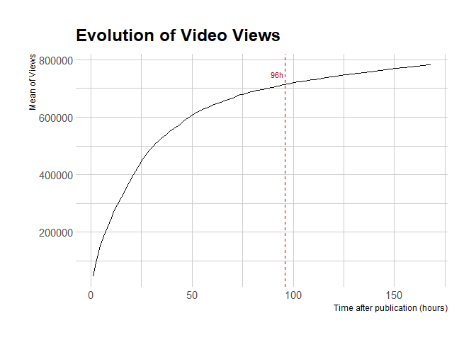

## Initial exploratory data analysis

In this project we use a dataset containing visual and temporal features from 1820 videos uploaded to facebook between August 1st, 2015 until October 15th, 2015 collected by Trzci´nski and Rokita and the data are available in <http://ii.pw.edu.pl/~ttrzcins/facebook_dataset_2015.csv>.

Our focus is on analysing the visual features, looking for some clue about the relationship between these visual features and the video popularity.


```r
# Reading data
facebook_data <- readRDS("../data/raw/facebook_data.rds")
visual_features <- readRDS("../data/processed/visual_features.rds")
temporal_features <- readRDS("../data/processed/temporal_features.rds")
temporal_features_long <- readRDS("../data/processed/temporal_features_long.rds")
```


- decidir qual o n views alvo para regressão (96 horas! 3 dias)


```r
temporal_features_long %>%
  filter(feature == "views") %>% 
  group_by(time) %>%
  summarise( m_views = mean(value) ) %>%
  ungroup() %>%
  ggplot(aes(x = as.numeric(time), y = m_views, group = 1)) +
  geom_line() +
  geom_vline(aes(xintercept = 96), colour = "#BB0000", linetype = "dashed") +
  annotate(geom = "text", x = 92, y = 750000, label = "96h",
           colour = "#BB0000", size = 3) +
  labs(x = "Time after publication (hours)", y = "Mean of Views", 
       title = "Evolution of Video Views") +
  theme_ipsum()
```

<!-- -->


```r
visual_features %>%
  left_join(temporal_features %>% select(facebook_post_id, views_96 = views.96),
            by = "facebook_post_id") -> visual_96
```

- descritivas básicas de todas as variáveis visuais


- correlação? dos views com outras variáveis visuais


- regressão (qual técnica?)
